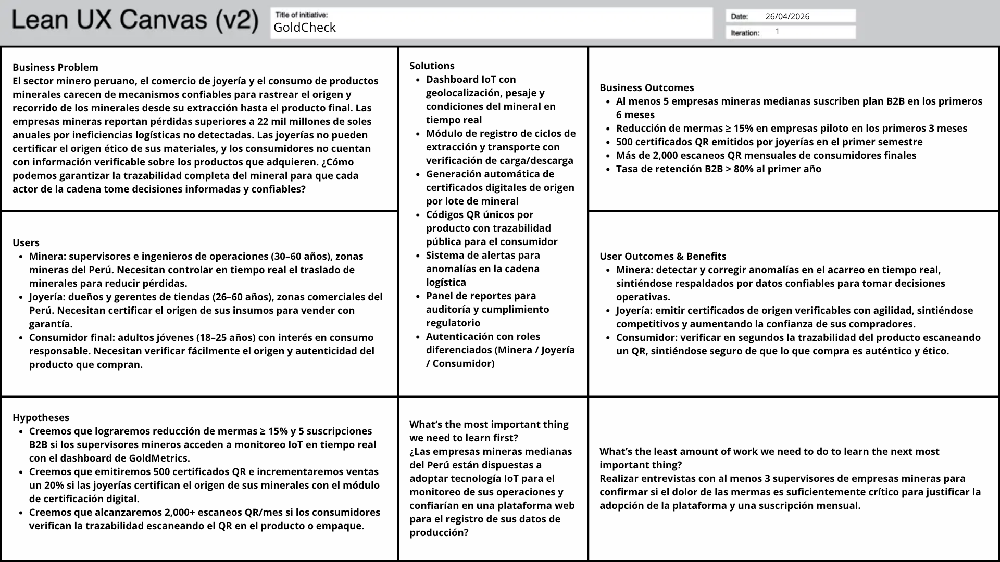

# CAPÍTULO I: INTRODUCCIÓN

## 1.1. Startup Profile

### 1.1.1. Descripción del Startup

Nuestra start up "Goldmetrics" está enfocada en el sector minero ya que se busca monitorear, analizar y validar el recorrido de los minerales desde su extracción hasta el producto final. Logramos esto al desarrollar una plataforma de trazabilidad de minerales implementando tecnología IoT, soluciones Web e Inteligencia Artificial.

La solución permite a las empresas mineras mejorar la eficiencia y la logística al reducir pérdidas y mejorar la gestión de las operaciones al usar datos en tiempo real. De la misma manera, brinda a las joyerías las herramientas necesarias para validar el origen de los minerales para que estos puedan vender productos de calidad.

Goldmetrics le garantiza al usuario la autenticidad del producto al permitir la transparencia de la información de estos, lo cual promueve una compra consciente y sobre todo ética.

Misión: Desarrollar tecnologías que permitan rastrear, analizar y certificar el recorrido de los minerales, garantizando la autenticidad de los productos y promoviendo la responsabilidad social.

Visión: Gold Metrics busca posicionarse como la plataforma líder en trazabilidad minera de América Latina conectando tanto a empresas como a consumidores con información confiable y verificable.

### 1.1.2. Perfiles de integrantes del equipo

| Integrantes | Descripción |
| :--- | :--- |
| | **Nombres y Apellidos:** Adrian Andres Armestar Felipa   **Código:** U202410084   **Carrera:** Ingenieria de Software   Soy una persona confiable, adaptable y responsable en cuanto a las entregas de los trabajos. Me especializo en el lenguaje C++ pero también tengo conocimientos acerca de base de datos y JavaScript. Poseo una mentalidad de mejora continua, donde busco aprender y mejorar mis habilidades. Del mismo modo, busco trabajar de manera constante y con una adecuada gestión del tiempo. |
| | **Nombres y Apellidos:** García Paredes, Victor Manuel   **Código:** U202012001   **Carrera:** Ingenieria de Software   Estudiante de la carrera de ingeniería de software con sólidos conocimientos en desarrollo de aplicaciones, estructuras de datos y programación orientada a objetos. Tengo experiencia en el uso de C++, así como en la gestión de proyectos mediante herramientas como Git y GitHub para el control de versiones. También tengo un conocimiento básico sobre Python, MSSQL y MongoDB. Me caracterizo por ser una persona responsable, con iniciativa para el aprendizaje autónomo, y con habilidades para el trabajo en equipo y la comunicación efectiva de ideas. |
| | **Nombres y Apellidos:** Carolina Celeste Navarro Aldoradin   **Código:** U20241b962   **Carrera:** Ingenieria de Software   Soy una persona resiliente, analítica y creativa. Tengo conocimientos en el lenguaje C++, Python, Javascript, SQL y Vercel, así como conocimientos en telemetría y IoT industrial. Poseo habilidades de gestión del tiempo y gestión de proyectos y estoy enfocada en la resolución de problemas y optimización de procesos. |
| | **Nombres y Apellidos:** Katty Yolanda Philco Mota   **Código:** U202416107   **Carrera:** Ingeniería de Software   Soy una persona organizada, responsable y comprometida con mi crecimiento académico. Cuento con conocimientos en programación, especialmente en C++, así como en estructuras de datos, algoritmos y desarrollo de soluciones tecnológicas orientadas a proyectos reales. Me destaco por mi capacidad de análisis, resiliencia frente a los desafíos y disposición para el trabajo en equipo. Me interesa el desarrollo de proyectos innovadores que generen impacto, manteniendo siempre una actitud de aprendizaje constante y mejora continua. |
| | **Nombres y Apellidos:** Kiara Lucia Tuesta Girón   **Código:** U20251I2025   **Carrera:** Ingenieria de Software   Tengo 20 años y me interesa el desarrollo de aplicaciones. He trabajado con lenguajes como C++ y C#, y también tengo experiencia usando SQL para bases de datos. En trabajos en equipo me gusta participar activamente, aportar ideas y ayudar a que el grupo avance. |

## 1.2. Solution Profile

Somos GoldMetrics, una startup integrada por estudiantes de la carrera de Ingeniería de Software de la Universidad Peruana de Ciencias Aplicadas. Nuestra startup se centra en la industria minera, con el objetivo de monitorear, examinar y certificar el camino de los minerales desde su extracción hasta el producto final. Esto se logra mediante el desarrollo de una plataforma que permite la trazabilidad de minerales, utilizando tecnología IoT, soluciones web e inteligencia artificial.

**Misión:** Desarrollar tecnologías de vanguardia que permitan rastrear, examinar y validar el trayecto de los minerales, asegurando la autenticidad de los productos y promoviendo activamente la responsabilidad social en la industria.

**Visión:** Consolidarnos como la empresa líder en trazabilidad minera en América Latina, conectando a toda la cadena de valor: desde la mina hasta el consumidor; con información confiable, inmutable y verificable.

### 1.2.1. Antecedentes y problemática

#### What?

El problema se centra en la falta de trazabilidad confiable de minerales en el Perú, lo cual impide reconocer el origen, autenticidad y recorrido de materiales como oro u otros metales.

Según la directora ejecutiva de la Sociedad Nacional de Minería, Angela Grossheim, rastrear el origen de minerales, especialmente el oro, es difícil debido al mercado informal mezclándose con el mercado formal (DesdeAdentro, 2025). Esto indica que en el sector hay incertidumbre sobre si los minerales provienen de fuentes legales, del mismo modo en el que se pueden manipular los datos de los productos lo cual incrementa el riesgo de pérdidas y/o fraude.

#### Who?

Alrededor de esta problemática se pueden identificar varios involucrados, principalmente a las empresas mineras, pues estas presentan dificultades para mantener un control claro de sus operaciones logísticas. Lo cual termina en ineficiencia operativa, fallas en las maquinarias y sobre todo pérdidas económicas y de material.

Por su lado, otros actores involucrados serían las joyerías y los consumidores finales, puesto que estos buscan adquirir productos auténticos y que estos posean un origen ético. Sin embargo, al no contar con datos confiables se genera una desconfianza en el mercado alrededor del verdadero valor de ciertos productos.

#### Where?

Este problema se presenta alrededor del sector minero, como en las zonas de extracción, las etapas de transporte, el almacenamiento, procesamiento y comercialización de los minerales.

#### When?

La problemática sucede en momentos como el transporte, procesamiento y transferencia de los minerales.

#### Why?

Chopra y Meindl (2013) afirman que la información es uno de los principales drivers del rendimiento de una cadena de suministro, ya que permite coordinar actividades y maximizar la rentabilidad total; cuando esa información es inexacta, incompleta o inaccesible, la cadena incurre en ineficiencias que se traducen en pérdidas económicas directas (p. 454).

Este problema surge por la poca implementación de tecnologías para el monitoreo y control de los minerales, siendo que varias empresas siguen usando registros manuales cuyos datos pueden ser fácilmente manipulados.

#### How?

El problema ocurre debido a la falta de seguimiento de los minerales, por lo que nuestros usuarios utilizarán la solución cuando necesiten asegurar el control y validación de los minerales.

#### How much?

Esta problemática tiene impactos en varios sectores, especialmente el económico. Según el fiscal coordinado de las Fiscalías Especializadas en Materia Ambiental, Frank Almanza, afirmó que las pérdidas económicas por minería ilegal equivale al 2,5% del PBI (Canchari, 2025). Gracias a esto, podemos deducir que la falta de trazabilidad afecta no solo a los ingresos de las empresas, sino que afecta a la economía nacional, resaltando lo importante que es el buscar una solución a dicha problemática.

### 1.2.2. Lean UX Process

#### 1.2.2.1. Lean UX Problem Statements

Siguiendo el proceso Lean UX propuesto por Gothelf y Seiden (2021), el equipo formuló problem statements orientados a iniciativas nuevas, los cuales enmarcan el problema desde la perspectiva del dominio actual (domain), los segmentos de clientes afectados (customer segments), los puntos de dolor identificados (pain points), la brecha existente en el mercado (gap), la visión y estrategia de solución (visión/strategy) y el segmento inicial de enfoque (initial segment).

**Problem Statement 1 (Empresas Mineras)**

El estado actual del sector minero peruano se ha centrado principalmente en procesos manuales de registro y en sistemas de reporte empírico para el control de operaciones logísticas.

Lo que los productos y servicios existentes no logran abordar es la ausencia de un mecanismo confiable, automático e inmutable que permita monitorear en tiempo real el traslado, pesaje y condiciones de los minerales a lo largo de toda la cadena logística.

GoldMetrics abordará esta brecha mediante una plataforma web integrada con tecnología IoT que automatice el registro de datos de geolocalización, pesaje y condiciones del mineral en cada etapa de la operación.

Nuestro enfoque inicial será el segmento de empresas mineras medianas del Perú que requieran optimizar su logística de acarreo y reducir pérdidas operativas.

Sabremos que hemos tenido éxito cuando observemos que las empresas mineras piloto reporten una reducción de mermas de al menos un 15% durante los primeros tres meses de uso, y cuando logremos suscribir a cinco empresas mineras a nuestro plan B2B.

**Problem Statement 2 (Joyerías)**

El estado actual del mercado de joyería en el Perú se ha centrado en la comercialización de piezas sin disponer de mecanismos formales, accesibles e inmutables para certificar el origen de los minerales utilizados en su fabricación.

Lo que los productos y servicios existentes no logran abordar es la imposibilidad de las joyerías de demostrar a sus clientes que los minerales que emplean provienen de fuentes éticas y legalmente verificadas.

GoldMetrics abordará esta brecha mediante un sistema que permita a las joyerías emitir certificados digitales respaldados por datos trazables desde la mina, accesibles a través de códigos QR vinculados a cada pieza.

Nuestro enfoque inicial será el segmento de tiendas y distribuidores de joyas ubicados en zonas comerciales del Perú que busquen diferenciarse mediante la certificación de origen.

Sabremos que hemos tenido éxito cuando las joyerías afiliadas reporten un incremento del 20% en las ventas de joyas certificadas respecto a su inventario regular, y cuando logremos emitir 500 certificados QR en el primer semestre de operación.

**Problem Statement 3 (Consumidores Finales)**

El estado actual del mercado de consumo de joyería y productos minerales en el Perú se ha centrado en la experiencia de compra estética y en el precio, sin proveer al consumidor final información verificable sobre el origen y la trazabilidad del producto adquirido.

Lo que los productos y servicios existentes no logran abordar es la falta de un canal transparente y de fácil acceso que permita al consumidor confirmar la autenticidad y el origen ético del producto antes o después de su compra.

GoldMetrics abordará esta brecha ofreciendo al consumidor final acceso a la trazabilidad completa del mineral mediante el escaneo de un código QR impreso en el producto o en su empaque.

Nuestro enfoque inicial será el segmento de consumidores adultos jóvenes con interés en el consumo responsable que adquieran productos de joyería en establecimientos afiliados a la plataforma.

Sabremos que hemos tenido éxito cuando alcancemos más de 2,000 escaneos de códigos QR por mes en productos afiliados, y cuando el tiempo promedio de sesión en la vista de trazabilidad supere un minuto y treinta segundos.

#### 1.2.2.2. Lean UX Assumptions

Gothelf y Seiden (2021) explican que cada sección del Lean UX Canvas es en sí misma un ejercicio de declaración de assumptions. En lugar de trabajar con requisitos rígidos, los equipos declaran sus suposiciones sobre el negocio, los usuarios, los outcomes esperados y las soluciones propuestas para identificar los mayores riesgos antes de construir nada. A continuación se presentan las assumptions del equipo organizadas en las cinco categorías del Lean UX Canvas v2.

**Assumption 1: Business Problem**

Según Gothelf y Seiden (2021), el Business Problem es la assumption central que encuadra todo el trabajo del equipo: define el reto específico a resolver desde la perspectiva del negocio, sin prescribir una solución. El equipo asume lo siguiente:

El estado actual del sector minero peruano, del comercio de joyería y del consumo de productos minerales se ha centrado principalmente en la cadena de extracción y comercialización sin disponer de mecanismos confiables, automáticos e inmutables para rastrear el origen y recorrido de los minerales. Creemos que esta falta de trazabilidad genera pérdidas económicas significativas para las empresas mineras, impide a las joyerías certificar el origen ético de sus materiales y deja al consumidor final sin información verificable sobre los productos que adquiere. GoldMetrics buscará resolver esta brecha mediante una plataforma integrada que conecte a todos los actores de la cadena con datos confiables y verificables. Sabremos que hemos resuelto el problema cuando observemos una reducción de mermas en empresas mineras piloto, un incremento en ventas de productos certificados en joyerías afiliadas, y un crecimiento sostenido en el uso del sistema de trazabilidad por parte de consumidores.

**Assumption 2: Business Outcomes**

Gothelf y Seiden (2021) definen los business outcomes como los cambios de comportamiento medibles en los usuarios del sistema que indicarán que el problema de negocio ha sido resuelto. El equipo declara las siguientes suposiciones sobre los resultados que espera observar:

- Creemos que al menos cinco empresas mineras medianas del Perú suscribirán un plan B2B dentro de los primeros seis meses desde el lanzamiento.
- Creemos que las empresas mineras piloto reportarán una reducción de mermas de al menos un 15% durante los primeros tres meses de uso de la plataforma.
- Creemos que las joyerías afiliadas emitirán 500 certificados QR en el primer semestre, evidenciando la adopción del módulo de certificación digital.
- Creemos que la plataforma alcanzará más de 2,000 escaneos mensuales de códigos QR por parte de consumidores finales en productos afiliados.
- Creemos que la tasa de retención de usuarios B2B superará el 80% al término del primer año de operación.

**Assumption 3: Users**

Gothelf y Seiden (2021) señalan que Box 3 del canvas sirve para declarar las suposiciones del equipo sobre quiénes son los usuarios y clientes del producto, utilizando proto-personas como punto de partida antes de la validación con investigación real. El equipo asume los siguientes perfiles de usuario:

- Empresas mineras: representadas por supervisores e ingenieros de operaciones de entre 30 y 60 años que trabajan en zonas de extracción del Perú. Necesitan controlar en tiempo real el traslado y las condiciones de los minerales para reducir pérdidas operativas.
- Joyerías: representadas por dueños y gerentes de tiendas de entre 26 y 60 años ubicados en zonas comerciales del Perú. Necesitan certificar el origen de sus insumos para ofrecer productos auténticos y diferenciarse en el mercado.
- Consumidores finales: adultos jóvenes de entre 18 y 25 años con interés en el consumo responsable. Necesitan acceder fácilmente a información verificable sobre el origen y autenticidad de los productos que adquieren.

**Assumption 4: User Outcomes & Benefits**

Gupta y Singh (2021) sostienen que los consumidores con orientación hacia la responsabilidad social modifican activamente sus decisiones de compra cuando disponen de información verificable sobre el origen y las condiciones de producción de los bienes que adquieren, siendo la transparencia de la cadena productiva un factor determinante en la construcción de confianza hacia el producto (p. 87). Gothelf y Seiden (2021) explican que Box 4 trata sobre las metas y beneficios de los usuarios: qué quieren lograr, cómo quieren sentirse durante y después del proceso, y qué cambios de comportamiento se podrán observar cuando el producto funcione correctamente. De esta manera el equipo declara las siguientes suposiciones:

- Creemos que los supervisores mineros lograrán detectar y corregir anomalías en el acarreo de minerales en tiempo real, reduciendo su incertidumbre operativa y sintiéndose respaldados por datos confiables en la toma de decisiones.
- Creemos que los dueños de joyerías podrán emitir y compartir certificados de origen con sus clientes de forma ágil, sintiéndose competitivos frente a otras joyerías que no ofrecen esta garantía y aumentando la confianza de sus compradores.
- Creemos que los consumidores finales lograrán verificar la trazabilidad del producto que van a adquirir en segundos mediante el escaneo de un código QR, tomando decisiones de compra informadas y sintiéndose seguros de que el producto es auténtico y de origen ético.

**Assumption 5: Solutions**

Gothelf y Seiden (2021) indican que Box 5 es el momento en que el equipo declara sus suposiciones sobre qué funcionalidades o características del producto cree que permitirán alcanzar los outcomes definidos para el negocio y los usuarios. Schwab (2016) señala que cualquier paquete, palet o contenedor puede equiparse con sensores, transmisores o etiquetas RFID que permiten a una empresa rastrear su ubicación y condiciones a lo largo de toda la cadena de suministro, transformando radicalmente la capacidad de monitoreo en tiempo real de operaciones complejas y de alto riesgo (p. 22). El equipo asume que las siguientes soluciones serán efectivas:

- Dashboard de monitoreo IoT en tiempo real con datos de geolocalización, pesaje y condiciones del mineral durante el acarreo, orientado a supervisores mineros.
- Módulo de registro de ciclos de extracción y transporte con verificación de carga y descarga por parte de operadores autorizados.
- Generación automática de certificados digitales de origen vinculados a cada lote de mineral procesado y transferido a joyerías.
- Emisión de códigos QR únicos por producto en joyerías, que ofrezcan al consumidor acceso público a la trazabilidad completa del mineral.
- Sistema de alertas y notificaciones para eventos críticos en la cadena logística, como anomalías de peso, desvíos de ruta o condiciones fuera de rango.
- Panel de reportes descargables para auditoría interna y cumplimiento regulatorio, dirigido a gerentes y responsables de operaciones.
- Módulo de autenticación con roles diferenciados para empresas mineras, joyerías y consumidores finales.

#### 1.2.2.3. Lean UX Hypothesis Statements

Siguiendo la plantilla definida por Gothelf y Seiden (2021) en la tercera edición de Lean UX, cada hypothesis statement vincula un business outcome (Box 2) con una persona (Box 3), un user outcome o beneficio (Box 4) y una solución concreta (Box 5). Esta estructura garantiza que cada hipótesis sea específica y testeable.

**Hipótesis 1:**

Creemos que lograremos una reducción de mermas de al menos un 15% en empresas mineras piloto durante los primeros tres meses de uso y suscribiremos a cinco empresas mineras a nuestro plan B2B,

si los supervisores e ingenieros de operaciones de empresas mineras medianas del Perú

logran acceder a datos de geolocalización, pesaje y condiciones del mineral en tiempo real durante el acarreo,

con el módulo de monitoreo IoT y el dashboard de operaciones de GoldMetrics.

**Hipótesis 2:**

Creemos que lograremos un incremento del 20% en ventas de joyas certificadas en joyerías afiliadas y emitiremos 500 certificados QR en el primer semestre de operación,

si los dueños y gerentes de joyerías ubicadas en zonas comerciales del Perú

logran emitir y compartir con sus clientes certificados digitales que demuestren el origen ético y la trazabilidad completa de los minerales en sus productos,

con el módulo de certificación digital y generación de códigos QR de GoldMetrics.

**Hipótesis 3:**

Creemos que alcanzaremos más de 2,000 escaneos de códigos QR por mes en productos afiliados y un tiempo promedio de sesión superior a un minuto y treinta segundos en la vista de trazabilidad,

si los consumidores finales adultos jóvenes con interés en el consumo responsable

logran verificar de manera transparente y en pocos segundos el origen, recorrido y autenticidad del producto que están por adquirir o que ya adquirieron,

con la funcionalidad de trazabilidad pública accesible mediante escaneo de código QR en el producto o empaque.

#### 1.2.2.4. Lean UX Canvas

## 1.3. Segmentos Objetivo

### Segmento 1: Empresas mineras

#### Descripción general:

Se refiere a las empresas que se dedican a la extracción de los minerales que terminan siendo procesados en productos pero que tienen problemas en la trazabilidad de sus operaciones.

#### Perfil Operativo:
Incluye a ingenieros y supervisores de entre 30 a 60 años que trabajan en las zonas mineras del Perú.

#### Datos del sector:
Según Canchari (2025), los problemas de trazabilidad y control en el sector minero genera mas de 22 mil millones de soles como perdidas al año.

#### Necesidad:
Este segmento necesita herramientas tecnológicas que permita el monitoreo en tiempo real para optimizar la logística en el ámbito minero.

### Segmento 2: Joyerías

#### Descripción general:
Se refiere a empresas que venden productos cuyo material principal son los minerales pero que tienen dificultades al momento de garantizar el origen de dichos productos.

#### Perfil Operativo:
Incluye a dueños y gerentes de dichas tiendas cuya edad varia entre 26 a 60 años ubicados en zonas comerciales del Perú.

#### Datos del sector:
Según el presidente de la Sociedad Nacional de Mineria, Petroleo y Energia, Victor Gobitz, la minería ilegal implementa más del millón de onzas de oro al mercado (Cruz, 2024). Esta alarmante cantidad significa que existe una alta probabilidad de que las joyerías vendan productos con una trazabilidad inexistente.

#### Necesidad:
Este segmento necesita herramientas tecnológicas que permitan validar el origen del mineral para ofrecer una certificación confiable a los clientes.

### Segmento 3: Consumidores finales

#### Descripción general:
Se refiere a personas que compran productos como joyas.

#### Perfil Operativo:
Incluye adultos jóvenes de entre 18 a 25 años con un interés en el consumo responsable.

#### Datos del sector:
Según el Anuario Minero 2024 del Minem, el Perú produjo 100 mil toneladas de oro, pero exporto 200 mil (Nuñez, 2025). Esto indica que alrededor de 100 mil toneladas de oro ilegales pueden ser exportadas mediante canales formales los cuales terminan siendo compradas por los consumidores.

#### Necesidad:
Este segmento necesita herramientas que les permita acceder a la información del producto de manera sencilla para poder reconocer su origen y autenticidad.
