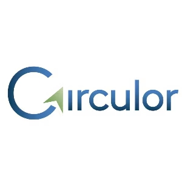

# CAPÍTULO II: REQUIREMENTS ELICITATION & ANALYSIS

## 2.1. Competidores

### 2.1.1. Análisis competitivo

<table border="1">
<!-- Encabezado Superior -->
<tr>
<th colspan="5"><b>Competitive Analysis Landscape</b></th>
<th colspan="4"></th>
</tr>
<tr>
<td width="20%">¿Por qué llevar a cabo este análisis?</td>
<td colspan="5">Identificar brechas en el mercado de trazabilidad minera y posicionar a GoldMetrics frente a soluciones telemáticas y plataformas OEM.</td>
</tr>

<!-- Encabezado de Columnas -->

<tr>
<td colspan="2"> <b>Competidores</b> </td>
<td>
    
    <b>GoldMetrics</b>
</td>
<td> 

  <b>Competidor 1: Geotab (Minería)</b>
</td>
<td>
 

 

<b>Competidor 2: Caterpillar MineStar / Modular (Komatsu)</b></td>
<td>

 

 
<b>Competidor 3: Circulor / Tracemark / MineHub</b></td>
</tr>

<!-- Sección Perfil -->

<tr>
<td rowspan="2" style="vertical-align: middle; transform: rotate(-90deg);"><b>Perfil</b></td>
<td>Overview</td>
<td>Plataforma de inteligencia de datos especializada en optimización de activos mineros.</td>
<td>Líder mundial en telemática y gestión de flotas con hardware robusto.</td>
<td>Sistemas de gestión de flota (FMS) integrados directamente en la maquinaria.</td>
<td>Plataformas enfocadas en cumplimiento ESG y trazabilidad de cadena de suministro (Blockchain).</td>
</tr>
<tr>
<td>Ventaja competitiva</td>
<td>Agilidad en integración de datos y visualización personalizada de KPIs operativos.</td>
<td>Ecosistema masivo de datos y compatibilidad multimarca mediante hardware plug-and-play.</td>
<td>Control total del hardware de la máquina y automatización profunda del ciclo de carga.</td>
<td>Especialización en normativas de sostenibilidad y "pasaporte digital" de minerales.</td>
</tr>

<!-- Sección Marketing -->

<tr>
<td rowspan="2" style="vertical-align: middle; transform: rotate(-90deg);"><b>Perfil de Marketing</b></td>
<td>Mercado objetivo</td>
<td>Minas medianas y grandes que buscan optimizar costos operativos.</td>
<td>Empresas de logística minera y flotas de transporte terrestre.</td>
<td>Grandes corporaciones mineras con flotas monomarca o de alto tonelaje.</td>
<td>Empresas mineras enfocadas en exportación a Europa/EE.UU. y cumplimiento ético.</td>
</tr>
<tr>
<td>Estrategias de marketing</td>
<td>Venta consultiva enfocada en eficiencia y retorno de inversión (ROI).</td>
<td>Alianzas con revendedores globales y marketplace de aplicaciones.</td>
<td>Venta directa integrada en la compra de activos (maquinaria pesada).</td>
<td>Marketing de reputación, transparencia y cumplimiento de estándares globales (LME).</td>
</tr>
<tr>
<td rowspan="3" style="vertical-align: middle; transform: rotate(-90deg);"><b>Perfil de Producto</b></td>
<td>Productos & Servicios</td>
<td>Dashboards analíticos, monitoreo en tiempo real y reportes automáticos.</td>
<td>Dispositivos GO9, software MyGeotab y análisis de comportamiento de conducción.</td>
<td>Sistemas de guiado GPS, gestión de fatiga y autonomía de camiones.</td>
<td>Software de seguimiento de activos mediante tecnología de registro distribuido.</td>
</tr>
<tr>
<td>Precios & Costos</td>
<td>SaaS (Suscripción mensual) escalable por número de activos.</td>
<td>Costo de hardware inicial + suscripción mensual por dispositivo.</td>
<td>Capex elevado (Licenciamiento perpetuo o incluido en el activo) + soporte.</td>
<td>Suscripciones corporativas premium basadas en volumen de material trazado.</td>
</tr>
<tr>
<td>Canales de distribución (Web y/o Móvil)</td>
<td>Web App y notificaciones móviles integradas.</td>
<td>Plataforma Web, Apps móviles y APIs para integración externa.</td>
<td>Sistemas embebidos en cabina y centros de control locales (on-premise).</td>
<td>Plataformas Cloud (Web) con acceso para múltiples actores de la cadena.</td>
</tr>
<tr>
<td rowspan="4" style="vertical-align: middle; transform: rotate(-90deg);"><b>Análisis SWOT</b></td>
<td>Fortalezas</td>
<td>Flexibilidad y enfoque en el usuario final.</td>
<td>Escalabilidad y robustez del hardware probado.</td>
<td>Integración técnica inigualable con el motor y sistemas del equipo.</td>
<td>Posicionamiento único en el nicho de "Minería Verde".</td>
</tr>
<tr>
<td>Debilidades</td>
<td>Menor reconocimiento de marca frente a gigantes.</td>
<td>Instalación de hardware físico requerida en cada unidad.</td>
<td>Sistemas cerrados y muy costosos para flotas mixtas.</td>
<td>Complejidad en la implementación con proveedores externos.</td>
</tr>
<tr>
<td>Oportunidades</td>
<td>Expansión a minería artesanal o pequeña escala desatendida.</td>
<td>Integración con vehículos eléctricos mineros.</td>
<td>Dominio del mercado de camiones autónomos.</td>
<td>Nuevas regulaciones ambientales estrictas a nivel mundial.</td>
</tr>
<tr>
<td>Amenazas</td>
<td>Consolidación de competidores grandes adquiriendo startups.</td>
<td>Commoditización de los servicios básicos de GPS.</td>
<td>Resistencia de las minas a cambiar sistemas ya instalados de fábrica.</td>
<td>Cambios rápidos en los protocolos tecnológicos de trazabilidad.</td>
</tr>
</table>

### 2.1.2. Estrategias y tácticas frente a competidores
- **Estrategia Defensiva: Neutralizar las Fortalezas de los Competidores**
Enfoque: Si no puedes vencer su hardware, integra su data.
  - ***Táctica de "Capa Superior" (vs. OEMs/Geotab)***: No intentes competir fabricando hardware más robusto que Caterpillar o Geotab. Posiciona a GoldMetrics como la plataforma agnóstica que consolida los datos de ambas fuentes en un solo dashboard.
  - ***Táctica de Alianzas Técnicas***: Desarrollar APIs abiertas y conectores pre-configurados para que el cliente sienta que GoldMetrics "desbloquea" el valor de la maquinaria que ya compró, en lugar de ser un sistema que compite con el fabricante.

2. **Estrategia Ofensiva: Explotar las Debilidades de la Competencia**
Enfoque: Agilidad vs. Burocracia y Flexibilidad vs. Rigidez.
   - ***Táctica de Flotas Mixtas (vs. OEMs)***: Los OEMs suelen fallar cuando una mina tiene camiones Komatsu y palas Caterpillar. Ataca este punto crítico ofreciendo una visión 360° que los fabricantes no pueden (o no quieren) dar por proteger su ecosistema cerrado.
   - ***Táctica de "Cero Fricción" (vs. Geotab)***: Mientras Geotab requiere tiempos de instalación física y configuración de hardware, implementa un modelo de ingesta de datos vía API (Cloud-to-Cloud) para que el cliente vea resultados en días, no meses.
   - ***Táctica de Precios SaaS (vs. Alto Capex de OEMs)***: Elimina la barrera del "pago inicial millonario". Implementa una estructura de costos operativos (OpEx) que permita a minas medianas acceder a tecnología de punta sin comprometer su flujo de caja.

3. **Estrategia de Oportunidad: Liderar en Trazabilidad y ESG**
Enfoque: Simplificar lo complejo.

   - ***Táctica "ESG-Light":*** Las plataformas como Circulor son extremadamente complejas. Crea un módulo de Reportabilidad Automática de Carbono que tome los datos de consumo de combustible ya existentes en GoldMetrics y los transforme en reportes de cumplimiento para inversionistas con un solo clic.
   - ***Táctica de Nicho (Minería de Media Escala):*** Mientras los grandes se pelean por las "Tier 1" (BHP, Rio Tinto), enfócate en capturar el mercado de minería mediana que está siendo presionada por regulaciones ambientales pero no tiene el presupuesto para soluciones a medida de millones de dólares.

4. **Estrategia de Mitigación de Amenazas: Construcción de Foso (Moat)**
Enfoque: Blindar la relación con el cliente.
  - ***Táctica de Éxito del Cliente (High-Touch):*** Los gigantes ofrecen soporte mediante tickets y call centers. GoldMetrics debe ofrecer Consultoría de Optimización incluida en la suscripción, donde un experto analice los KPIs junto al jefe de mina mensualmente para asegurar el ROI.
  - ***Táctica de Modularidad:*** Para evitar que un competidor grande te desplace por precio, permite que el cliente compre solo el módulo que necesita (ej. solo "Gestión de Neumáticos" o solo "Consumo de Diésel"). Una vez dentro de su ecosistema, la expansión es mucho más natural.

## 2.2. Entrevistas

### 2.2.1. Diseño de entrevistas

  **Primer Segmento:** A continuación, se presentan las preguntas dirigidas al segmento de empresas mineras, conformado por profesionales y organizaciones responsables de la extracción, transporte y gestión de minerales. Este segmento se encarga de la obtención y movilización de los recursos, enfrentando desafíos relacionados con el control y la trazabilidad.

  - **Preguntas principales:**
1.	¿Cómo registran actualmente el traslado de minerales?
2.	¿Existen problemas de pérdida o falta de control?
3.	¿Cuál es tu principal objetivo en la gestión de materiales o minerales?
4.	¿Qué herramientas usan para monitoreo?
5.	¿Qué tan común es la falta de trazabilidad?
6.	¿Qué impacto tiene en costos o producción?
7.	¿Crees útil un sistema que rastree minerales desde la extracción?
8.	¿Qué información sería clave para ustedes?
9.	¿Qué tan frecuente es la ocurrencia de fallas durante la obtención de minerales?
10.	¿Cómo identifican actualmente los errores o fallas en la extracción de minerales?

- **Preguntas complementarias**
1.	¿Cuál es tu edad?
2.	¿En qué distrito o zona vives?
3.	¿Cuál es tu estado civil?
4.	¿Qué dispositivos utilizas con mayor frecuencia en tu trabajo?
5.	¿Utilizas aplicaciones o sistemas digitales en tus labores diarias? ¿Cuáles?
6.	¿Qué rol desempeñas dentro del sector minero?
7.	¿Qué es lo que más te frustra del proceso actual de control o traslado de minerales?

 **Segundo Segmento:** A continuación, se presentan las preguntas dirigidas al segmento de joyerías, integrado por personas que trabajan en la fabricación y comercialización de productos elaborados con minerales. Estas empresas pueden operar tanto con materiales provenientes de proveedores como con insumos proporcionados directamente por los clientes.

  - **Preguntas principales:**
1.	¿Cómo verificas la autenticidad de las joyas que vendes?
2.	¿Has tenido problemas con proveedores o materiales falsos?
3.	¿Qué tan importante es para tus clientes saber el origen de una joya?
4.	¿Llevas algún registro del origen de tus productos?
5.	¿Tus clientes te piden certificación o pruebas de autenticidad?
6.	¿Cómo generas confianza al vender?
7.	¿Qué problemas has tenido con la trazabilidad o calidad del material?
8.	¿Has perdido ventas por falta de confianza del cliente?
9.	¿Qué haces cuando un cliente trae su propio material (oro u otros minerales)?
10.	¿Cómo manejas o comunicas la autenticidad cuando el material es proporcionado por el cliente?

- **Preguntas complementarias**
1.	¿Cuál es tu edad?
2.	¿En qué distrito o zona vives?
3.	¿Cuál es tu estado civil?
4.	¿Qué rol desempeñas dentro de la joyería?
5.	¿Usas sistemas digitales para gestionar ventas o inventario?
6.	¿Qué es lo más difícil al trabajar con materiales proporcionados por proveedores o clientes?

**Tercer Segmento:** A continuación, se presentan las preguntas dirigidas al segmento de usuarios consumidor, es decir, personas que adquieren productos fabricados con minerales, como joyas. Este segmento se caracteriza por su creciente interés en la autenticidad, la transparencia y el origen ético de los productos que consume.

  - **Preguntas principales:**
1.	¿Con qué frecuencia compras joyas?
2.	¿Qué factores consideras al comprar (precio, marca, material, etc.)?
3.	¿Te preocupa si una joya es auténtica?
4.	¿Cómo sabes si una joya es real?
5.	¿Te importa el origen del producto (si es ético o no)?
6.	¿Pagarías más por una joya certificada como ética?
7.	¿Qué tanta confianza tienes en la información que brindan las marcas sobre sus productos?
8.	¿Te gustaría poder verificar por ti mismo el origen de un producto mediante una app o código QR?
9.	¿Qué tipo de información te gustaría conocer antes de comprar una joya o producto mineral?
10.	 ¿Dejarías de comprar una marca si supieras que sus productos provienen de explotación laboral o prácticas poco éticas?

- **Preguntas complementarias**
1.	¿Cuál es tu edad?
2.	¿En qué distrito o zona vives?
3.	¿Cuál es tu estado civil?
4.	¿Qué dispositivos utilizas con mayor frecuencia (celular, laptop, etc.)?
5.	¿Qué opinas de productos con certificaciones como “cruelty-free” o “eco-friendly”?
6.	¿Qué buscas principalmente al comprar una joya o producto (ej. calidad, estatus, significado, inversión)?

### 2.2.2. Registro de entrevistas
| Segmento: Empresas Mineras | Entrevista #1 |
| --- | --- |
| Nombres y Apellidos | Maximiliano Lopez Melgarejo|
| Edad | 22 años |
| Distrito | Callao |
| Ocupación | Especialista en mecatrónica de camiones mineros |
| Timming inicio |00:00:00 - 00:11:29 |
| Duración | 11 minutos y 29 segundos|
| URL | [Ver entrevista](https://upcedupe-my.sharepoint.com/:v:/g/personal/u202416107_upc_edu_pe/IQDu6FgeSAQyTIWq7Mi2D3PWAYw61dd-gFnSQCx1kfl35Zs?nav=eyJyZWZlcnJhbEluZm8iOnsicmVmZXJyYWxBcHAiOiJTdHJlYW1XZWJBcHAiLCJyZWZlcnJhbFZpZXciOiJTaGFyZURpYWxvZy1MaW5rIiwicmVmZXJyYWxBcHBQbGF0Zm9ybSI6IldlYiIsInJlZmVycmFsTW9kZSI6InZpZXcifX0%3D&e=OlpPYE) |
| Screenshot |  |
| Resumen | El entrevistado es Maximiliano Lopez Melgarejo, un joven de 22 años residente en el Callao, especializado en mecatrónica de camiones mineros. Su trabajo se enfoca en el mantenimiento de equipos pesados utilizando tecnologías como sensores, cámaras y módulos electrónicos que permiten monitorear en tiempo real el rendimiento, condiciones del vehículo y carga transportada. En el proceso de traslado de minerales, destaca la importancia del control de carga, ya que exceder los límites establecidos puede generar riesgos operativos, pérdidas económicas e incluso accidentes. Además, menciona que uno de los principales problemas es la pérdida de material durante el trasbordo entre camiones, lo que afecta la eficiencia del proceso. Respecto a la trazabilidad, señala que existe una ruptura en la cadena una vez que el mineral es vendido a terceros, perdiéndose el seguimiento hasta el consumidor final. También enfatiza que cualquier sistema de monitoreo debe garantizar la confidencialidad de los datos, ya que la información sobre extracción y producción es altamente sensible para las empresas. Finalmente, indica que las fallas se gestionan mediante sistemas de monitoreo y mantenimiento preventivo, aunque las paradas por reparación representan un alto costo operativo. En este contexto, resalta la necesidad de equilibrar la continuidad de la producción con la seguridad y el buen estado de los equipos. |

| Segmento: Empresas Mineras | Entrevista #2 |
| --- | --- |
| Nombres y Apellidos | Lynn Marin |
| Edad |30 años|
| Distrito |  San Miguel |
| Ocupación | Ingeniera mecatrónica |
| Timming inicio | 00:11:29 - 00:29:02 |
| Duración | 17 minutos y 33 segundos|
| URL | [Ver entrevista](https://upcedupe-my.sharepoint.com/:v:/g/personal/u202416107_upc_edu_pe/IQDu6FgeSAQyTIWq7Mi2D3PWAYw61dd-gFnSQCx1kfl35Zs?nav=eyJyZWZlcnJhbEluZm8iOnsicmVmZXJyYWxBcHAiOiJTdHJlYW1XZWJBcHAiLCJyZWZlcnJhbFZpZXciOiJTaGFyZURpYWxvZy1MaW5rIiwicmVmZXJyYWxBcHBQbGF0Zm9ybSI6IldlYiIsInJlZmVycmFsTW9kZSI6InZpZXcifX0%3D&e=OlpPYE) |
| Resumen | La entrevistada es una ingeniera mecatrónica de 30 años que trabaja en un laboratorio de electrónica en Ferreyros, enfocada en la confiabilidad del armado y mantenimiento de motores para minería. Su labor está altamente vinculada al uso de tecnologías avanzadas, como sensores, actuadores y sistemas digitales para el monitoreo y análisis de datos en tiempo real.En cuanto a la gestión y monitoreo, utiliza herramientas como el software Tracking para rastrear componentes, así como plataformas como Smarty y Daris, que permiten recolectar información técnica y controlar equipos de forma remota. Su principal objetivo es maximizar la vida útil de los motores, asegurar su confiabilidad y reducir los tiempos de entrega, todo bajo un enfoque orientado a resultados económicos medibles. Respecto a la trazabilidad, destaca que es un elemento clave en procesos complejos, permitiendo conocer el estado, ubicación e historial de los componentes en todo momento. Sin embargo, señala que las empresas mineras son cautelosas al compartir esta información por motivos de confidencialidad y competencia. Además, enfatiza la importancia de analizar datos históricos y en tiempo real para implementar mantenimiento predictivo y evitar fallas recurrentes. En conclusión, identifica como principal frustración la dependencia de registros manuales, los cuales generan pérdida de tiempo y menor eficiencia operativa. En este sentido, promueve la automatización mediante sensores y sistemas integrados que permitan capturar datos de manera automática, optimizando los procesos y mejorando la toma de decisiones. |

| Segmento: Empresas Mineras | Entrevista #3 |
| --- | --- |
| Nombres y Apellidos | Max Alonso Yapo Figueroa|
| Edad | 31 años |
| Distrito | Arequipa (Cercado)|
| Ocupación | Ingeniero metalurgista |
| Timming inicio |00:29:02 - 00:35:29 |
| Duración | 6 minutos y 27 segundos|
| URL | [Ver entrevista](https://upcedupe-my.sharepoint.com/:v:/g/personal/u202416107_upc_edu_pe/IQDu6FgeSAQyTIWq7Mi2D3PWAYw61dd-gFnSQCx1kfl35Zs?nav=eyJyZWZlcnJhbEluZm8iOnsicmVmZXJyYWxBcHAiOiJTdHJlYW1XZWJBcHAiLCJyZWZlcnJhbFZpZXciOiJTaGFyZURpYWxvZy1MaW5rIiwicmVmZXJyYWxBcHBQbGF0Zm9ybSI6IldlYiIsInJlZmVycmFsTW9kZSI6InZpZXcifX0%3D&e=OlpPYE) |
| Screenshot | |
| Resumen | El entrevistado es un profesional de 31 años, residente en Arequipa, que se desempeña como jefe de metalurgia y operaciones. En su trabajo utiliza principalmente el celular y la laptop, además de herramientas especializadas como Molycop. Actualmente, el registro del traslado de minerales se realiza mediante plantillas de Excel, complementadas con personal encargado del seguimiento desde la mina hasta la planta. Sin embargo, este proceso presenta limitaciones, ya que el control es en gran parte empírico, lo que genera errores en el pesaje de los volquetes y en las balanzas. Estos errores, aunque inicialmente pequeños, se acumulan con el tiempo y generan cuellos de botella operativos, afectando la precisión de los datos. Si bien existe un monitoreo constante mediante personal distribuido en la ruta, la trazabilidad no siempre es completamente precisa. Respecto a las fallas, suelen ser de nivel leve a moderado y están relacionadas con factores operativos. Además, el registro de incidentes se realiza de forma manual (en papel), utilizando dispositivos digitales solo para comunicación, lo que limita la eficiencia del proceso. Finalmente, el entrevistado considera que la implementación de un sistema digital de rastreo desde la extracción sería altamente beneficiosa, destaca la importancia de contar con información precisa sobre la ubicación del mineral y el tonelaje exacto, ya que los errores en estos datos afectan directamente el control del concentrado y la toma de decisiones en la planta.|

| Segmento: Joyerías | Entrevista #1 |
| --- | --- |
| Nombres y Apellidos | Yesiliany Canchica Muñoz |
| Edad | 21 años |
| Distrito | Surquillo |
| Ocupación | Secretaria de Joyería |
| Timming inicio |00:35:29 - 00:40:20 |
| Duración | 4 minutos y 51 segundos|
| URL | [Ver entrevista](https://upcedupe-my.sharepoint.com/:v:/g/personal/u202416107_upc_edu_pe/IQDu6FgeSAQyTIWq7Mi2D3PWAYw61dd-gFnSQCx1kfl35Zs?nav=eyJyZWZlcnJhbEluZm8iOnsicmVmZXJyYWxBcHAiOiJTdHJlYW1XZWJBcHAiLCJyZWZlcnJhbFZpZXciOiJTaGFyZURpYWxvZy1MaW5rIiwicmVmZXJyYWxBcHBQbGF0Zm9ybSI6IldlYiIsInJlZmVycmFsTW9kZSI6InZpZXcifX0%3D&e=OlpPYE) |
| Screenshot | |
| Resumen | La entrevistada es una joven de 21 años que reside en Surquillo, ella trabaja como secretaria en una joyería desempeñando funciones operativas dentro del negocio. La gestión de inventarios se realiza de manera manual, ellos no realizan digitalización para los procesos internos del negocio. Respecto al control de calidad, la empresa utiliza tanto métodos tradicionales como tecnológicos para verificar la autenticidad del oro, como la prueba del ácido nítrico y máquinas de medición de quilataje. Sin embargo, uno de los principales desafíos identificados es el trabajo con materiales proporcionados por los clientes, puesto que si el oro no posee la calidad adecuada, el proceso de refinamiento implica una merma significativa pudiendo perderse hasta 1.5 gramos por cada 5 gramos iniciales. Respecto a la trazabilidad, la joyería mantiene relaciones de confianza con proveedores desde hace más de 10 años lo que garantiza la autenticidad del material adquirido. Por otro lado, los clientes valoran altamente el origen de las joyas y suelen exigir certificaciones especialmente en piezas con piedras preciosas. Finalmente, ella menciona que la confianza del cliente se construye a través de la transparencia, informando sobre la calidad real de las piezas y sus posibles riesgos. En síntesis, se observa un entorno de trabajo tradicional, enfocado en la experiencia y la calidad con oportunidades de mejora en la incorporación de herramientas digitales para la gestión. |

| Segmento: Joyerías | Entrevista #2 |
| --- | --- |
| Nombres y Apellidos | Ginny Céspedes Mundaca |
| Edad | 54 años |
| Distrito | Tarapoto, San Martin |
| Ocupación | Dueña de Joyería|
| Timming inicio | 00:40:20 - 00:48:54 |
| Duración | 08 minutos y 34 segundos|
| URL | [Ver entrevista](https://upcedupe-my.sharepoint.com/:v:/g/personal/u202416107_upc_edu_pe/IQDu6FgeSAQyTIWq7Mi2D3PWAYw61dd-gFnSQCx1kfl35Zs?nav=eyJyZWZlcnJhbEluZm8iOnsicmVmZXJyYWxBcHAiOiJTdHJlYW1XZWJBcHAiLCJyZWZlcnJhbFZpZXciOiJTaGFyZURpYWxvZy1MaW5rIiwicmVmZXJyYWxBcHBQbGF0Zm9ybSI6IldlYiIsInJlZmVycmFsTW9kZSI6InZpZXcifX0%3D&e=OlpPYE) |
| Screenshot | |
| Resumen |La entrevistada es la propietaria de una joyería en Tarapoto con aproximadamente 26 años de experiencia en el rubro. Trabaja junto a su esposo, quien es el orfebre del negocio, y basa gran parte de la verificación de autenticidad en su conocimiento técnico y experiencia. No utilizan sistemas digitales ni llevan un registro formal del origen de los materiales, lo que evidencia un manejo tradicional del negocio. En cuanto a la autenticidad y calidad, confían plenamente en la experiencia del orfebre para identificar materiales genuinos, lo que les ha permitido evitar problemas con proveedores. Sin embargo, reconocen que muchos consumidores sí son engañados en el mercado informal, lo que refuerza la importancia del conocimiento técnico en el sector. Respecto a la trazabilidad, los clientes no suelen exigir certificaciones ni información sobre el origen de las joyas, ya que la confianza se basa principalmente en la trayectoria del negocio y la garantía de calidad (oro de 18 quilates). No obstante, la entrevistada considera que implementar herramientas como códigos QR o sellos de certificación sería una oportunidad para diferenciarse y generar mayor confianza. Finalmente, uno de los principales desafíos es la informalidad del mercado, ya que adquirir oro con documentación legal eleva considerablemente los costos, reduciendo la competitividad y los márgenes de ganancia. Esto obliga al negocio a recurrir a proveedores informales, lo que limita la trazabilidad completa del material a pesar de mantener estándares de calidad en el producto final. |

| Segmento: Joyerías | Entrevista #3 |
| --- | --- |
| Nombres y Apellidos | Vicky Ríos Macedo |
| Edad | 42 años |
| Distrito | Tarapoto, San Martin |
| Ocupación | Dueña de Joyería |
| Timming inicio |00:48:54 - 01:03:25 |
| Duración | 14 minutos y 31 segundos |
| URL | [Ver entrevista](https://upcedupe-my.sharepoint.com/:v:/g/personal/u202416107_upc_edu_pe/IQDu6FgeSAQyTIWq7Mi2D3PWAYw61dd-gFnSQCx1kfl35Zs?nav=eyJyZWZlcnJhbEluZm8iOnsicmVmZXJyYWxBcHAiOiJTdHJlYW1XZWJBcHAiLCJyZWZlcnJhbFZpZXciOiJTaGFyZURpYWxvZy1MaW5rIiwicmVmZXJyYWxBcHBQbGF0Zm9ybSI6IldlYiIsInJlZmVycmFsTW9kZSI6InZpZXcifX0%3D&e=OlpPYE) |
| Screenshot | |
| Resumen |La entrevistada es Vicky, una emprendedora del rubro de joyería de acero en Tarapoto. Su negocio se basa en la reventa de productos, y utiliza herramientas digitales básicas como videollamadas para coordinar con proveedores y medios de pago electrónicos. No cuenta con sistemas formales de gestión ni registros detallados del origen de los productos, lo que evidencia un manejo operativo simple. En cuanto a la autenticidad y calidad, la validación se realiza a través del uso personal. Tanto ella como su hija prueban los productos para asegurar que no pierdan brillo, no se oxiden y no causen alergias. La confianza hacia los clientes se construye mediante esta experiencia directa y ofreciendo garantías de cambio o devolución, más que a través de certificaciones formales. Respecto a la trazabilidad, existe un conocimiento limitado sobre el origen de los productos, ya que solo identifica que provienen de China y se distribuyen desde Lima. Los clientes, por su parte, no suelen exigir información sobre procedencia o certificaciones, priorizando más bien la estética, el precio accesible y la durabilidad del producto. Finalmente, la entrevistada muestra interés en la implementación de herramientas tecnológicas como códigos de trazabilidad, considerándolas una oportunidad para diferenciar su negocio. Esto refleja una apertura hacia la innovación, aunque actualmente el sector en el que opera no exige altos niveles de transparencia en comparación con otros rubros. |

| Segmento: Usuario consumidor | Entrevista #1 |
| --- | --- |
| Nombres y Apellidos | Carla Gallardo Morales |
| Edad | 19 años |
| Distrito | La Molina |
| Ocupación | Estudiante universitaria |
| Timming inicio |01:03:25 - 01:08:09 |
| Duración | 4 minutos y 44 segundos |
| URL | [Ver entrevista](https://upcedupe-my.sharepoint.com/:v:/g/personal/u202416107_upc_edu_pe/IQDu6FgeSAQyTIWq7Mi2D3PWAYw61dd-gFnSQCx1kfl35Zs?nav=eyJyZWZlcnJhbEluZm8iOnsicmVmZXJyYWxBcHAiOiJTdHJlYW1XZWJBcHAiLCJyZWZlcnJhbFZpZXciOiJTaGFyZURpYWxvZy1MaW5rIiwicmVmZXJyYWxBcHBQbGF0Zm9ybSI6IldlYiIsInJlZmVycmFsTW9kZSI6InZpZXcifX0%3D&e=OlpPYE) |
| Screenshot |  |
| Resumen | Carla Gallardo es una joven de 19 años que reside en La Molina, soltera y estudiante universitaria. Ella usa principalmente el celular y la computadora para sus actividades académicas, lo que evidencia un perfil digital activo. Su frecuencia de compra de joyas es baja, adquiriendo principalmente accesorios de acero y comprando oro o plata  cada tres años aproximadamente. Al comprar una joya, sus principales criterios son la autenticidad del material, el diseño, la marca y el precio, muestra una alta preocupación por la autenticidad, aunque reconoce tener poco conocimiento técnico, lo que genera desconfianza hacia mecanismos tradicionales como los sellos de quilataje, ya que pueden ser falsificados. Asimismo, ella también valora el origen ético de los productos, tiene una postura positiva hacia certificaciones como "cruelty-free" y afirma que estaría dispuesta a pagar más por una joya que garantice tanto autenticidad como condiciones laborales justas. Además, señala que dejaría de consumir una marca si descubre prácticas de explotación laboral. Antes de realizar una compra le gustaría tener información clara sobre la autenticidad del material, el precio y la procedencia del producto. Finalmente, considera que herramientas tecnológicas como la verificación mediante QR o aplicaciones serían una solución efectiva para aumentar la confianza del consumidor. |

| Segmento: Usuario consumidor | Entrevista #2 |
| --- | --- |
| Nombres y Apellidos | Mauricio Moquillaza |
| Edad | 19 años |
| Distrito | Jesús María |
| Ocupación | Estudiante|
| Timming inicio | 01:08:09 - 01:19:44|
| Duración |11 minutos y 35 segundos |
| URL | [Ver entrevista](https://upcedupe-my.sharepoint.com/:v:/g/personal/u202416107_upc_edu_pe/IQDu6FgeSAQyTIWq7Mi2D3PWAYw61dd-gFnSQCx1kfl35Zs?nav=eyJyZWZlcnJhbEluZm8iOnsicmVmZXJyYWxBcHAiOiJTdHJlYW1XZWJBcHAiLCJyZWZlcnJhbFZpZXciOiJTaGFyZURpYWxvZy1MaW5rIiwicmVmZXJyYWxBcHBQbGF0Zm9ybSI6IldlYiIsInJlZmVycmFsTW9kZSI6InZpZXcifX0%3D&e=OlpPYE) |
| Screenshot | |
| Resumen | El entrevistado es Mauricio Moquillaza, un joven de 19 años, residente en Jesús María, Lima, soltero. Utiliza con frecuencia el celular y la laptop, mostrando un perfil digital activo. Su frecuencia de compra de joyas es baja, aproximadamente una vez al año, priorizando productos duraderos y de larga vida útil. Al momento de comprar, se enfoca principalmente en la apariencia visual, la durabilidad y que el precio sea acorde al producto, restando importancia a la marca. Sin embargo, muestra una alta preocupación por la autenticidad, debido a la existencia de falsificaciones. Aunque posee conocimientos básicos de verificación (como pruebas caseras), su nivel de confianza en las marcas es bajo ya que considera que muchas utilizan el marketing como estrategia más que como garantía real. En cuanto al aspecto ético, considera importante el origen de las joyas, especialmente para evitar contribuir a la minería ilegal o explotación laboral. Afirma que estaría dispuesto a pagar un poco más por productos certificados y que dejaría de comprar una marca si se comprobara que incurre en prácticas poco éticas. Finalmente, destaca el valor de herramientas tecnológicas como aplicaciones o códigos QR para verificar la autenticidad y trazabilidad del producto. Le gustaría acceder a información clara sobre la pureza del material y su procedencia, lo que refleja una necesidad de mayor transparencia y confianza en el mercado de joyería. |

| Segmento: Usuario consumidor | Entrevista #3 |
| --- | --- |
| Nombres y Apellidos | Oliver Galindo |
| Edad | 20 años |
| Distrito | Comas |
| Ocupación | Estudiante |
| Timming inicio |01:19:44 - 01:29:28 |
| Duración | 09 minutos y 44 segundos|
| URL | [Ver entrevista](https://upcedupe-my.sharepoint.com/:v:/g/personal/u202416107_upc_edu_pe/IQDu6FgeSAQyTIWq7Mi2D3PWAYw61dd-gFnSQCx1kfl35Zs?nav=eyJyZWZlcnJhbEluZm8iOnsicmVmZXJyYWxBcHAiOiJTdHJlYW1XZWJBcHAiLCJyZWZlcnJhbFZpZXciOiJTaGFyZURpYWxvZy1MaW5rIiwicmVmZXJyYWxBcHBQbGF0Zm9ybSI6IldlYiIsInJlZmVycmFsTW9kZSI6InZpZXcifX0%3D&e=OlpPYE) |
| Screenshot | |
| Resumen |El entrevistado es Oliver Galindo, un joven de 20 años, residente en Comas, soltero. Utiliza principalmente el celular y la computadora, lo que refleja un perfil digital activo. Su frecuencia de compra de joyas es baja y está orientada principalmente a la adquisición de obsequios solo ocasiones especiales. Al comprar, prioriza la calidad y la durabilidad del producto, seguido de la relación calidad-precio. Aunque inicialmente el diseño puede ser más relevante que la autenticidad técnica, menciona que sí muestra interés en verificar la veracidad del producto consultando al vendedor o revisando sellos de autenticidad, especialmente en materiales como oro o perlas. Respecto al origen ético, considera importante consumir productos legales y responsables, aunque reconoce que es difícil acceder a esta información. Por ello, opta por comprar en lugares formales para reducir riesgos. Además, estaría dispuesto a pagar más por productos con certificación ética y afirma que dejaría de comprar marcas vinculadas a la explotación laboral. Finalmente, percibe un bajo nivel de confianza en las marcas, ya que considera que muchas veces la información es solo marketing. En este contexto, valora positivamente el uso de herramientas tecnológicas como códigos QR o aplicaciones que permitan verificar la autenticidad y procedencia del producto, evidenciando una necesidad de mayor transparencia en el mercado. |

### 2.2.3. Análisis de entrevistas
Analisis por segmento y gráficas y porcentajes:

**Análisis Primer Segmento Empresas Mineras:** En primer lugar, existe una desconexión entre la data técnica y el impacto financiero. Según Lynn Marín, los sistemas actuales permiten recolectar información detallada sobre fallas y mantenimiento, pero no logran traducir estos datos en indicadores económicos claros. Esto evidencia la necesidad de soluciones que conviertan automáticamente la información técnica en pérdidas o ganancias en tiempo real, facilitando la toma de decisiones.

En segundo lugar, en el área de operaciones se identifica un problema crítico en la precisión del pesaje. La principal frustración no radica en la falta de tecnología digital, sino en errores físicos en el tonelaje de los volquetes, los cuales afectan directamente el cálculo del concentrado.

En tercer lugar, se evidencia una resistencia a los procesos manuales, especialmente en el uso de checklists en papel. Los operarios consideran estas tareas como una pérdida de tiempo, lo que genera una clara oportunidad para implementar sistemas automatizados mediante sensores que optimicen la captura de datos.

En cuarto lugar, se identifica una ruptura en la trazabilidad de la cadena de suministro. Una vez que el mineral es vendido a terceros, se pierde el seguimiento del mismo, dificultando la validación de su origen especialmente en industrias como la joyería. Esta desconexión limita la transparencia y el control a lo largo del ciclo de vida del mineral.

En conjunto, el segmento minero evidencia una dualidad operativa: mientras el 67% (2 de 3) presenta un alto nivel de digitalización enfocado en mantenimiento predictivo y monitoreo en tiempo real, el 33% (1 de 3) aún depende de procesos manuales para el control productivo. A pesar de esta diferencia, el 100% considera excelente contar con un sistema que rastree el mineral o los componentes desde su origen. Sin embargo, existe una resistencia total a compartir información con la competencia o distribuidores externos por temor a perder competitividad o exponer debilidades operativas. Esto revela que la oportunidad no está solo en digitalizar, sino en automatizar y asegurar la información, conectando datos técnicos con impacto económico en toda la cadena de valor.

**Análisis Segundo Segmento Joyerías:** En conjunto, el segmento joyería presenta una diversidad de perfiles que reflejan distintas realidades del sector: la empresaria tradicional (Ginny), la emprendedora emergente (Vicky) y la secretaria (Yesiliany). A pesar de sus diferencias, el 100% coincide en operar con esquemas tradicionales sin uso de sistemas digitales formales para la gestión de inventarios lo que evidencia un bajo nivel de digitalización en el rubro. En cuanto a la verificación de autenticidad, el 67% se basa en conocimiento técnico especializado (orfebres y la prueba de ácido nítrico), mientras que el 33% usa métodos empíricos como el uso personal del producto. 

Respecto a la trazabilidad, el 100% presenta ausencia o limitaciones en el registro formal del origen de los materiales. Esta situación está directamente relacionada con factores estructurales del mercado, como la informalidad y el alto costo del oro legal. Por ejemplo, adquirir oro con factura puede costar hasta 550 soles por gramo, mientras que el precio competitivo del mercado ronda los 460 soles, lo que obliga a recurrir a proveedores informales para mantener la rentabilidad.

En el aspecto operativo, se identifican ineficiencias en el manejo del material, como pérdidas de hasta 30% en procesos de purificación al trabajar con oro de clientes. Desde la perspectiva del cliente, el 67% de entrevistadas indica que no existe una demanda activa por certificaciones, especialmente en productos de menor valor como el acero, donde se prioriza la estética. Sin embargo, en joyas de mayor valor la importancia de su autenticidad alcanza niveles altos, especialmente en piezas con piedras preciosas. Finalmente, el 100% de los entrevistados muestra apertura hacia la implementación de tecnologías que permitan mostrar al cliente el origen del producto (como códigos QR) considerándolas una oportunidad para diferenciarse y fortalecer la confianza del cliente.

**Análisis Tercer Segmento Consumidor Final :** En conjunto, los consumidores entrevistados presentan un comportamiento de compra poco frecuente, orientado principalmente a ocasiones específicas. El 100% prioriza factores como la calidad, durabilidad y precio, mientras que la marca tiene una relevancia baja en la decisión de compra.

Respecto a la confianza y autenticidad, el 100% de los entrevistados manifiesta preocupación por la veracidad del producto, aunque reconoce tener un bajo conocimiento técnico para verificarlo. Como consecuencia, recurren a métodos como consultar al vendedor o usar pruebas básicas, lo que incrementa la incertidumbre durante la compra.

En cuanto a la confianza en las marcas, el 67% presenta un nivel de confianza bajo o moderado, percibiendo que muchas empresas utilizan el marketing sin garantizar realmente la autenticidad o el origen del producto.

Por otro lado, el 100% de los entrevistados valora el origen ético de los productos y estaría dispuesto a pagar un costo adicional (moderado) por garantizar autenticidad y condiciones laborales justas. Asimismo, el 100% muestra interés en herramientas tecnológicas como códigos QR o aplicaciones, que permitan verificar la procedencia, pureza y legalidad del producto antes de la compra.

## 2.3. Needfinding
Para llevar a cabo el proceso de needfinding en GoldCheck, se realizaron entrevistas en profundidad con usuarios pertenecientes a los segmentos objetivo, incluyendo consumidores finales, joyeros y profesionales del sector minero. Estas conversaciones se centraron en comprender sus hábitos, objetivos y principales frustraciones relacionadas con la autenticidad, trazabilidad y confianza en la comercialización de joyas y minerales.

Gracias a esta exploración, se identificaron áreas críticas de mejora, como la falta de transparencia en el origen de los materiales, la baja confianza en los productos adquiridos y la limitada adopción de herramientas digitales en los procesos del sector minero. Asimismo, se evidenció la existencia de brechas tanto tecnológicas como informativas que afectan la toma de decisiones de los usuarios. Durante las entrevistas, surgieron patrones y necesidades recurrentes, como la importancia de contar con un sistema confiable que permita verificar la autenticidad, procedencia y valor real de los productos. De esta manera, se logra identificar una oportunidad clara para desarrollar una solución como GoldCheck, que facilite el acceso a información validada y mejore la confianza en la cadena de valor.

### 2.3.1. User Personas

**Segmento Objetivo: Empresas mineras:**

**Segmento Objetivo: Joyerías:**

**Segmento Objetivo: Consumidor final:**

### 2.3.2. User Task Matrix
<table border="1" cellpadding="8" cellspacing="0" style="border-collapse: collapse; text-align: center;">
  
  <!-- Main header -->
  <tr style="background-color:#f2f2f2;">
    <th rowspan="2">Task</th>
    <th colspan="2">Leonardo Gonzales (Mining Engineer)</th>
    <th colspan="2">Elena Rosas (Jewelry Business Owner)</th>
    <th colspan="2">Pilar Chavez (Final Consumer)</th>
  </tr>

  <!-- Sub header -->
  <tr style="background-color:#f2f2f2;">
    <th>Frequency</th>
    <th>Importance</th>
    <th>Frequency</th>
    <th>Importance</th>
    <th>Frequency</th>
    <th>Importance</th>
  </tr>

  <!-- Rows -->
  <tr>
    <td>Verify material authenticity</td>
    <td>Medium</td>
    <td>High</td>
    <td>High</td>
    <td>High</td>
    <td>High</td>
    <td>High</td>
  </tr>

  <tr>
    <td>Evaluate material quality/purity</td>
    <td>High</td>
    <td>High</td>
    <td>High</td>
    <td>High</td>
    <td>Medium</td>
    <td>High</td>
  </tr>

  <tr>
    <td>Record material data (origin, quantity)</td>
    <td>High</td>
    <td>High</td>
    <td>Medium</td>
    <td>High</td>
    <td>Low</td>
    <td>Medium</td>
  </tr>

  <tr>
    <td>Monitor material transportation</td>
    <td>High</td>
    <td>High</td>
    <td>Low</td>
    <td>Medium</td>
    <td>Low</td>
    <td>Low</td>
  </tr>

  <tr>
    <td>Search for information before purchasing</td>
    <td>Low</td>
    <td>Medium</td>
    <td>Medium</td>
    <td>High</td>
    <td>High</td>
    <td>High</td>
  </tr>

  <tr>
    <td>Trust suppliers / sellers</td>
    <td>High</td>
    <td>High</td>
    <td>High</td>
    <td>High</td>
    <td>High</td>
    <td>High</td>
  </tr>

  <tr>
    <td>Manage inventory or stock</td>
    <td>Medium</td>
    <td>Medium</td>
    <td>High</td>
    <td>High</td>
    <td>Low</td>
    <td>Low</td>
  </tr>

  <tr>
    <td>Detect errors or failures</td>
    <td>High</td>
    <td>High</td>
    <td>Medium</td>
    <td>High</td>
    <td>Low</td>
    <td>Medium</td>
  </tr>

  <tr>
    <td>Communicate information</td>
    <td>High</td>
    <td>High</td>
    <td>High</td>
    <td>High</td>
    <td>Medium</td>
    <td>Medium</td>
  </tr>

  <tr>
    <td>Evaluate price vs quality</td>
    <td>Medium</td>
    <td>High</td>
    <td>High</td>
    <td>High</td>
    <td>High</td>
    <td>High</td>
  </tr>

  <tr>
    <td>Verify ethical origin</td>
    <td>Medium</td>
    <td>High</td>
    <td>Medium</td>
    <td>High</td>
    <td>High</td>
    <td>High</td>
  </tr>

</table>

### 2.3.3. User Journey Mapping

**Segmento Objetivo Empresas mineras:**

**Segmento Objetivo Joyerías:**

**Segmento Objetivo Consumidor final:**

### 2.3.4. Empathy Mapping
**Segmento Objetivo Empresas mineras:**

**Segmento Objetivo Joyerías:**

**Segmento Objetivo Consumidor final:**

## 2.4. Big Picture EventStorming
En la sesión de Big Picture Event Storming, el equipo exploró de forma visual el panorama general del dominio de telemetría en minería y trazabilidad de la cadena de valor para joyería de GoldMetrics. Se identificaron los eventos significativos del ciclo de vida de un activo monitoreado, desde el registro de la maquinaria hasta la respuesta ante incidentes críticos, integrando los sistemas externos que interactúan con la plataforma y exponiendo los problemas, dudas y oportunidades de mejora detectados durante la sesión. Esta primera aproximación permitió alinear el entendimiento del equipo y sentar las bases para el diseño detallado de la solución.

**Primera fase: Eventos**

**Mapa general:**
https://canva.link/yc2kttn17z9hf75

## 2.5. Ubiquitous Language
- **Machinery (Maquinaria)**: Cualquier unidad de equipo físico en la mina, como camiones de acarreo, palas o excavadoras, que genera datos y requiere monitoreo.

- **Haul Truck (Camión de acarreo)**: Vehículo pesado diseñado específicamente para transportar grandes volúmenes de material desde el punto de carga hasta el de descarga.

- **Fleet (Flota)**: Conjunto total de activos móviles que operan dentro de una unidad minera.

- **OEM - Original Equipment Manufacturer (Fabricante de Equipo Original)**: Empresas que fabrican la maquinaria (ej. Caterpillar, Komatsu). Sus sistemas de datos suelen ser cerrados o propietarios.

- **Haulage (Acarreo)**: El proceso de transportar material extraído desde el tajo (pit) hacia su destino (chancadora o botadero).

- **Cycle Time (Tiempo de ciclo)**: Tiempo total que tarda un activo en completar una secuencia completa: carga, transporte de ida, descarga y retorno vacío.

- **Loading Point (Punto de carga):** Ubicación específica en la mina donde el material es depositado en el camión por una pala o cargador.

- **Dumping Point / Dump (Punto de descarga / Botadero):** Destino final del material, ya sea para procesamiento (mineral) o almacenamiento (estéril).

- **Payload (Carga útil):** El peso real del material transportado por un activo en un solo ciclo, excluyendo el peso del vehículo.

- **Idle Time (Tiempo en ralentí):** Periodo en el que el motor del activo está encendido pero el vehículo no está realizando trabajo productivo ni desplazándose.

- **Downtime (Tiempo de inactividad):** Tiempo durante el cual un activo no está disponible para operar, ya sea por fallas mecánicas o mantenimiento programado.

- **Availability (Disponibilidad)**: Porcentaje de tiempo que un activo está en condiciones mecánicas para operar, independientemente de si se está usando o no.

- **Utilization (Utilización):** Proporción del tiempo de disponibilidad en el que el activo realmente está realizando tareas operativas.

- **Production (Producción):** Cantidad total de material (usualmente medido en toneladas) movido durante un periodo determinado.

- **Ore (Mineral):** Roca que contiene sustancias económicamente valiosas (oro, cobre, etc.) y que se envía a la planta de procesamiento.

- **Waste / Overburden (Estéril / Lastre):** Material que debe ser removido para acceder al mineral pero que no tiene valor económico. Se envía a los botaderos.

- **Grade (Ley):** La concentración de metal valioso contenido en el mineral extraído.

- **Telemetry (Telemetría):** Medición y transmisión inalámbrica de datos desde los sensores del activo (motor, GPS, peso) hacia la plataforma.

- **Fuel Consumption (Consumo de combustible):** Cantidad de combustible diesel utilizado por un activo, analizado generalmente por hora o por tonelada movida.

- **Engine Hours (Horas motor):** Tiempo acumulado de funcionamiento del motor de un activo, utilizado como base para los planes de mantenimiento.

- **Event (Evento):** Una ocurrencia específica detectada por los sensores que tiene relevancia operativa (ej. exceso de velocidad, fatiga del operador).

- **ESG - Environmental, Social, and Governance (Criterios ambientales, sociales y de gobernanza):** Marco de evaluación de la sostenibilidad y el impacto ético de la operación minera.

- **Traceability (Trazabilidad):** Capacidad de seguir el historial, la ubicación y la procedencia de un lote de mineral desde la mina hasta su destino final.

- **Engine Ignition (Encendido del motor):** Estado que indica que el motor principal del activo está operativo y consumiendo combustible

- **Communication loss (Pérdida de comunicación):** Falla en el flujo de datos entre los sensores del activo y la plataforma de monitoreo.

- **Exhaust Temperature (Temperatura de escape):** Indicador térmico de los gases de salida del motor, clave para prevenir daños mecánicos catastróficos.

- **Dossification Rail (Riel de dosificación):** Sistema encargado de la distribución precisa de combustible o aditivos en el motor.

- **Oil Pan (Cárter de aceite):** Depósito metálico que contiene el aceite lubricante del motor.

- **GNSS (Sistema Global de Navegación por Satélite):** Tecnología (como el GPS) utilizada para rastrear la ubicación y velocidad del activo en tiempo real.

- **Oil Filter pressure difference (Diferencial de presión del filtro de aceite):** Medida que indica el nivel de obstrucción del filtro; una diferencia alta sugiere la necesidad de cambio inmediato.

- **Fatigue event (Evento de fatiga):** Alerta generada cual el sistema detecta signos de cansancio o falta de atención en el operador.

- **Operator (Operador):** Persona responsable de la conducción y operación directa de una Machinery (Maquinaria) durante un turno. Es el principal generador de eventos como Speed excess o Fatigue events.

- **Supervisor (Supervisor):** Usuario con privilegios de gestión encargado de monitorear el desempeño de la flota, validar reportes y reaccionar ante alertas críticas o Accidents.

- **User (Usuario):** Término genérico para cualquier persona con credenciales de acceso al sistema, cuyo historial de Login y Registration es auditado por la plataforma.

- **Component (Componente):** Parte o sistema específico de un activo (ej. motor, transmisión, bomba hidráulica) que puede ser monitoreado o reemplazado de forma independiente.

- **Component Discharged (Componente dado de baja):** Estado que indica que una pieza ha sido retirada de un activo para su reemplazo o desecho.

- **Refinery (Refinería):** Instalación industrial donde el mineral procesado se purifica para obtener metal precioso (oro/plata) con grado de inversión o joyería.

- **Jeweler (Joyero):** El artesano o empresa final que transforma el metal precioso en piezas de joyería. En GoldMetrics, el joyero es un stakeholder interesado en la procedencia ética del material.

- **Ethical Gold (Oro Ético)**: Oro extraído bajo estándares que garantizan el respeto a los derechos humanos y el cumplimiento de normativas ambientales (ESG), un factor clave en la trazabilidad de la plataforma.

- **Bullion (Lingote / Metal en bruto):** Forma física del metal precioso (usualmente con 99.9% de pureza) antes de ser trabajado por un joyero.

- **Conflict-Free Certification (Certificación Libre de Conflicto):** Validación documental que asegura que el oro no proviene de zonas de guerra o financia actividades ilícitas, vinculada directamente al reporte de Traceability.

- **Dossification Rail Pressure (Presión del Riel de Dosificación):** Presión del sistema de inyección; niveles altos o bajos pueden indicar fallas inminentes.

- **Oil Filter Pressure Difference (Diferencial de Presión del Filtro de Aceite):** Diferencia entre la presión de entrada y salida del filtro, indicando qué tan obstruido está.

- **Durability (Durabilidad):** Capacidad de un Machinery o Component de mantener su función operativa bajo las condiciones extremas de la mina sin fallar.

- **PCR - Planned Component Replacement (Reemplazo Planificado de Componentes:)** Es el tiempo mínimo u óptimo de operación (medido en horas motor) que un componente debe durar antes de ser retirado de servicio para evitar fallas.

- **Preventive Maintenance (Mantenimiento Preventivo):** Tareas de servicio programadas basadas en el tiempo de operación para asegurar la longevidad del equipo.

