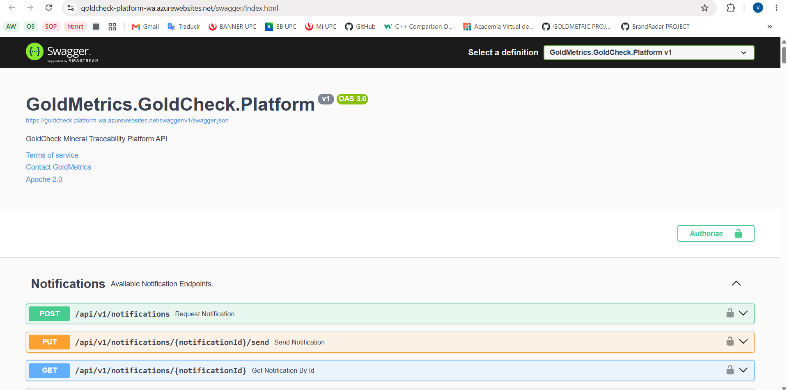
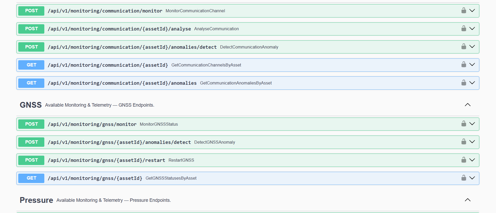
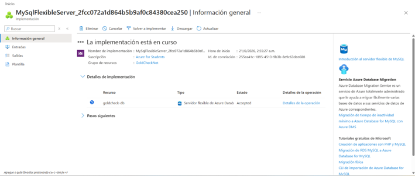
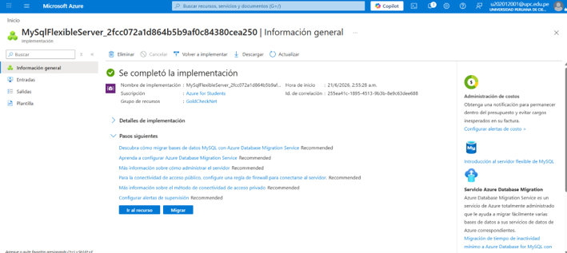
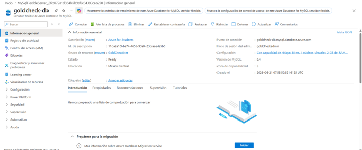
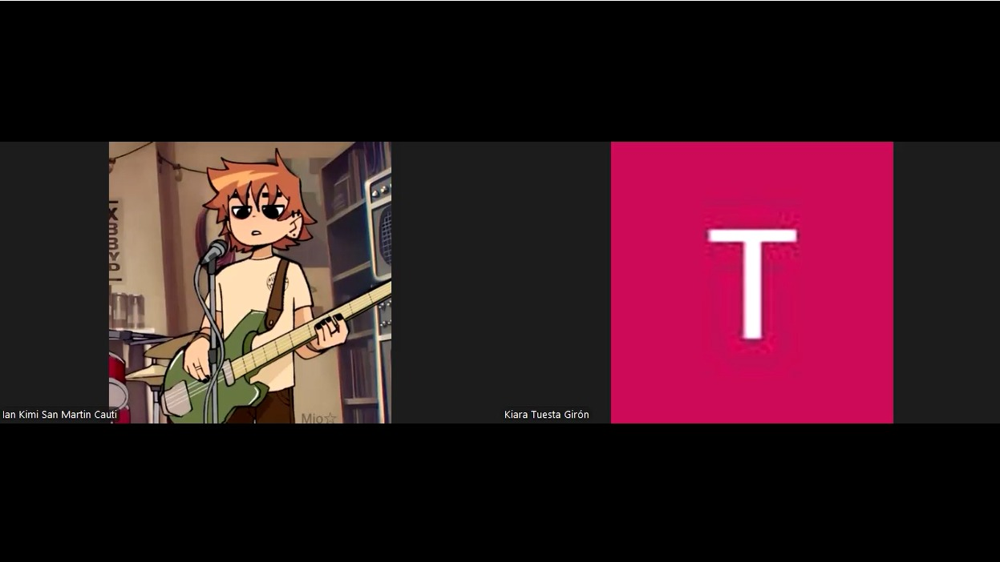
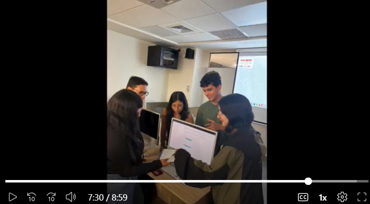

# CAPÍTULO V: Product Implementation, Validation & Deployment

## 5.1. Software Configuration Management

**-Project Management:**
1. Herramienta: Trello
Propósito: Gestión de tareas, planificación de sprints y seguimiento del progreso del equipo mediante tableros Kanban. 

**-Requirements Management:**
1. Herramienta: UXPressia
Propósito: Creación de artefactos de needfinding como User Personas, User Journey Maps y Empathy Maps para comprender las necesidades del usuario.
2. Herramienta: Miro
Propósito: Desarrollo de Event Storming (Big Picture y Process Level) para el modelado de procesos y definición del alcance del sistema.
3. Herramienta: Gherkin
Propósito: Definición de criterios de aceptación y escenarios de prueba en formato Given–When–Then.

**-Product UX/UI Design:**
1. Herramienta: Figma
Propósito: Diseño de wireframes y mockups de la interfaz del sistema, incluyendo la landing page.

**-Software Development:**
1. Herramienta: Visual Studio Code
Propósito: Entorno de desarrollo utilizado para la programación del sistema.
2. Herramienta: GitHub
Propósito: Control de versiones y trabajo colaborativo mediante repositorios, commits y ramas. Cada miembro del equipo clonará el repositorio para desarrollar de manera distribuida sus features.
3. Tecnología Frontend: Vue.js  
Lenguaje: JavaScript  
Propósito: Desarrollo de interfaces web interactivas y responsivas del sistema, permitiendo una experiencia de usuario dinámica mediante componentes reutilizables.
4. Tecnología Backend:
Lenguaje: C#  
Propósito: Desarrollo de la lógica del servidor, implementación de servicios RESTful, manejo de peticiones HTTP y comunicación con la base de datos.
5. Base de Datos: Microsoft SQL Server  
Propósito: Almacenamiento, gestión y consulta eficiente de la información del sistema, garantizando integridad y consistencia de los datos.
6. Herramienta: WebStorm  
Propósito: Entorno de desarrollo especializado para aplicaciones JavaScript y TypeScript, utilizado como soporte para el desarrollo frontend junto con Vue.js.

**-Software Deployment:**
1. Herramienta: GitHub Pages
Propósito: Despliegue de la solución de cada producto digital de OpalTrace desde nuestro repositorio de Github.

**-Software Documentation:**
1. Herramienta: Markdown
Propósito: Documentación técnica del proyecto (README y documentación del código).
2. Herramienta: Structurizr
Propósito: Elaboración de diagramas de arquitectura del sistema utilizando el modelo C4 (contexto, contenedores, componentes y código).

### 5.1.2. Source Code Management
Para el control de versiones y la organización ordenada del código de nuestro proyecto GoldCheck, el equipo utiliza GitHub como plataforma principal. GitHub nos permite almacenar código fuente de la Landing Page, Front-End, Back-End llevar un registro histórico de cambios, colaborar de manera estructurada y garantizar trazabilidad durante todo el ciclo de desarrollo. Por ende, creamos la organización Minex-Organization, que incluye los siguientes repositorios:
| Solución  | Nombre del repositorio  |  Enlace  |
|---|---|---|
| report | goldcheck-report  | https://github.com/upc-pre-202610-1asi0730-11863-GoldMetri/goldcheck-report.git |
| website  | goldcheck-website  |  https://github.com/upc-pre-202610-1asi0730-11863-GoldMetri/goldcheck-website.git |
| webapp  |  goldcheck-webapp  | https://github.com/upc-pre-202610-1asi0730-11863-GoldMetri/goldcheck-webapp.git |
| platform  | goldcheck-platform   | https://github.com/upc-pre-202610-1asi0730-11863-GoldMetri/goldcheck-platform.git   |

NNuestro equipo de trabajo ha adoptado el flujo GitFlow, basado en el artículo “A successful Git branching model” de Vincent Driessen. La organización del repositorio se estructura en dos ramas principales y permanentes: master, que contiene las versiones estables listas para entrega, y develop, que funciona como la rama de integración continua del desarrollo. A partir de la rama develop, se crean ramas de tipo feature siguiendo la nomenclatura feature/chapter-#-description, por ejemplo: feature/chapter-ii-interviews. Estas ramas permiten que cada miembro del equipo desarrolle funcionalidades o secciones específicas de manera aislada. En casos donde un integrante desarrolla un capítulo completo, se utiliza una convención como feature/chapter-#-content. Una vez finalizado el trabajo, estas ramas se integran nuevamente en develop, asegurando una consolidación ordenada de los avances.

Cuando el producto se aproxima a una fecha de entrega, se genera una rama release a partir de develop. En esta etapa se realizan ajustes menores, como corrección de errores o mejoras finales. Posteriormente, la rama release se fusiona tanto en master como en develop, garantizando que los cambios aplicados se mantengan en futuras iteraciones del proyecto. En cuanto a la gestión de versiones, se utiliza Semantic Versioning mediante ramas con el formato release/vX.Y.Z. Asimismo, las correcciones críticas se gestionan a través de ramas hotfix, con la nomenclatura hotfix/vX.Y.Z, permitiendo resolver errores urgentes directamente sobre la versión en producción.

Adicionalmente, el equipo aplica la convención Conventional Commits, la cual estandariza los mensajes de confirmación para mejorar la trazabilidad y comprensión de los cambios. Cada commit sigue una estructura clara, por ejemplo:

git commit -m "docs(chapter-#): add ..."

Este enfoque facilita la generación automática de historiales de cambios y permite mantener un registro organizado y semántico del desarrollo.

En síntesis, cada nueva funcionalidad se desarrolla en una rama feature, las versiones listas para entrega se gestionan mediante release branches, y las correcciones urgentes a través de hotfix branches. Todo ello, junto con el uso de Conventional Commits, asegura un flujo de trabajo estructurado, colaborativo y alineado con buenas prácticas para el desarrollo del proyecto GoldCheck.

**Repositorio report**

**Repositorio  website**

**Repositorio webapp**

**Repositorio platform**

### 5.1.3. Source Code Style Guide & Conventions
Como norma general, todo el código desarrollado en GoldCheck deberá estar completamente redactado en inglés, incluyendo nombres de variables, funciones, clases, archivos y comentarios, esto garantiza consistencia, mantenibilidad y alineación con estándares internacionales. Asimismo, el equipo adopta convenciones basadas en guías reconocidas como Google Style Guide, Microsoft C# Guidelines y Gherkin Best Practices, adaptadas al contexto del dominio minero y de trazabilidad definido en el Ubiquitous Language del proyecto.

1. Principios Generales
- Uso obligatorio del idioma inglés en todo el código.
- Nombres descriptivos alineados al dominio (ubiquitous language), por ejemplo: haulTruck, payload, traceabilityData, oreBatch
- Evitar ambigüedad: los nombres deben reflejar claramente su propósito.
- Priorizar automatización sobre procesos manuales (alineado a insights del proyecto).
2. HTML
- Uso de etiquetas y atributos en minúsculas
`<section id="traceability-report"></section>`
- Cerrar correctamente todos los elementos
`
Gold traceability data
`
- Uso de comillas dobles para atributos
`<button class="primary-button"></button>`
- Incluir atributos de accesibilidad (alt, width, height)
``
- Sangría de 2 espacios
3. CSS
- Uso de kebab-case para clases e IDs
`.traceability-card {}`
`.mineral-data {}`
- Uso opcional de BEM para componentes complejos
`.traceability-card__status--active {}`
- Omitir unidades en valores cero
`margin: 0;`
- Ordenar propiedades (alfabético o por bloques)
- Separar bloques con líneas en blanco para legibilidad
4. JavaScript
- Uso de camelCase para variables y funciones
`function calculatePayload() {}`
- Declaración de variables con const y let
`const payloadWeight = 120;`
`let cycleTime = 0;`
- Uso de ES6+ (arrow functions, destructuring, etc.)
- Manejo de errores
`try {`
`  processTelemetryData();`
`} catch (error) {`
`  console.error(error);`
`}`
- Evitar funciones largas (máx. 20–30 líneas)
5. C# (.NET / Backend)
- PascalCase para clases y métodos
`public class TraceabilityService {`
`    public void CalculateProduction() { }`
`}`
- camelCase para variables y parámetros
`int payloadWeight;`
- UPPER_SNAKE_CASE para constantes
`const int MAX_PAYLOAD = 400;`
- Sangría de 4 espacios (sin tabs)
- Principios clave: Single Responsibility, código modular Y comentarios claros y concisos
6. Gherkin (BDD)

Se utilizará Gherkin para definir escenarios de negocio relacionados a trazabilidad minera y validación de oro.

- Estructura obligatoria: Given – When – Then
- Lenguaje entendible para negocio (no técnico)
`Feature: Gold Traceability Verification`
`Scenario: Verify origin of gold`
`Given a user scans a QR code`
`When the system retrieves traceability data`
`Then the user should see the origin mine and certification`
- Uso de Scenario Outline cuando aplique
- Escenarios claros, cortos y orientados a valor

7. Uso del Ubiquitous Language
Todos los términos del dominio deben respetar el lenguaje definido en el sistema para asegurar consistencia entre negocio y tecnología, para que tanto desarrolladores como stakeholders hablen el mismo idioma dentro del sistema..

Ejemplos aplicados:

`HaulTruck`
`Payload`
`Traceability`
`Ore`
`Refinery`
`Jeweler`
`EthicalGold`
`Telemetry`

Ejemplo en código:

`const haulTruckPayload = calculatePayload(haulTruckData);`

### 5.1.4. Software Deployment Configuration
- Creación de la Website (Landing Page):
1. Se crea un repositorio (goldcheck-website) desde upc-pre-202610-1asi0730-12053-goldmetri

2. Agregar a los miembros del equipo

3. Habilitar GitHub Pages en branch master y ruta "/(root)"

- Creación de WebApp
1. Creación del repositorio (goldcheck-webapp) dentro de la organización upc-pre-202610-1asi0730-12053-goldmetri

2. Agregar a los miembros del equipo

- Creación de Platform
1. Creación del repositorio (goldcheck-platform) dentro de la organización upc-pre-202610-1asi0730-12053-goldmetri

2. Agregar a los miembros del equipo

- Creación de Mockapi
1. Creación del repositorio (goldcheck-mockapi) dentro de la organización upc-pre-202610-1asi0730-12053-goldmetri

2. Agregar a los miembros del equipo

## 5.2. Landing Page, Services & Applications Implementation

### 5.2.1. Sprint 1

#### 5.2.1.1. Sprint Planning 1

El Sprint 1 está dedicado exclusivamente a establecer la presencia digital de la startup mediante el diseño, desarrollo y despliegue de la primera versión del Landing Page de GoldCheck.

| Campo | Detalle |
|:------|:--------|
| **Sprint #** | Sprint 1 |
| **Date** | `2026-04-15` |
| **Time** | `6:00 pm` |
| **Location** | Reunión virtual por Discord |
| **Prepared By** | `Philco Mota, Katty` |
| **Attendees** | Armestar Felipa, Adrian / García Paredes, Victor / Navarro Aldoradin, Carolina / Philco Mota, Katty / Tuesta Girón, Kiara |
| **Sprint 1 Goal** | Establecer la presencia digital de GoldCheck mediante el diseño, desarrollo y despliegue de la Landing Page. Comunicaremos claramente nuestra propuesta de valor: garantizar la trazabilidad, transparencia y confianza en la cadena de suministro de oro y joyas desde minería responsable hasta joyerías auténticas y consumidores conscientes. El éxito se confirmará cuando visitantes accedan al sitio web en vivo y comprendan el problema que resolvemos y los beneficios que ofrecemos para minería, joyería y consumidores finales. |
| **Sprint 1 Velocity** | 20 Story Points |
| **Sum of Story Points** | `16` |

#### 5.2.1.2. Aspect Leaders and Collaborators

Para este primer Sprint enfocado en el Landing Page y la configuración inicial de los proyectos, la distribución de liderazgo (L) y colaboración (C) es la siguiente:

| Team Member (Last Name, First Name) | GitHub Username | UI/UX Design (Figma) | Landing Page Layout (HTML/CSS) | Landing Page Interactivity (JS) | DevOps & Deployment |
|:-----------------------------------:|:---------------:|:-------------:|:-------------:|:-------------:|:-------------:|
| Armestar Felipa, Adrian Andres | `Adrian5102` | C | L | C | C |
| García Paredes, Victor Manuel | `vicmacode` | C | L | L | C |
| Navarro Aldoradin, Carolina Celeste | `genixmvp` | L | L | L | C |
| Philco Mota, Katty Yolanda | `kattyph` | C | C | C | L |
| Tuesta Girón, Kiara Lucia | `kitu05g` | L | C | L | C |

> **L** = Leader &nbsp;|&nbsp; **C** = Collaborator

#### 5.2.1.3. Sprint Backlog 1

El objetivo principal de este Sprint es contar con un sitio web estático desplegado que presente a Goldmetrics y sus beneficios.

| **Sprint 1** | **User Story** | | **Work-Item / Task** | | | | |
|:--------:|---|---|---|---|---|---|---|
| | **ID** | **Título** | **ID** | **Título** | **Descripción** | **Estimación (h)** | **Asignado a** | **Estado** |
| | US01 | Visualizar propuesta de valor | T01 | Diseñar UI en Figma | Elaborar los mockups de la sección Hero y features del LP. | 4 | Navarro, Carolina | Done |
| | US01 | Visualizar propuesta de valor | T02 | Maquetar HTML/CSS base | Convertir el diseño de Figma a código HTML5 y CSS3 semántico. | 5 | Armestar, Adrian | Done |
| | US02 | Visualizar los segmentos | T03 | Programar vistas interactivas | Agregar dinamismo a las tarjetas de segmentos con JavaScript. | 3 | Tuesta, Kiara | Done |
| | US03 | Contactar al equipo | T04 | Maquetar Footer y Contacto | Implementar la sección de contacto y redes sociales. | 3 | García, Victor | Done |
| | *Task* | Configurar Repositorios | T05 | Setup GitHub y Despliegue | Inicializar los repos en GitHub y conectar Vercel al Landing Page. | 2 | Philco, Katty | Done |

#### 5.2.1.4. Development Evidence for Sprint Review

Durante el Sprint 1, el equipo se enfocó en establecer la base técnica de **GoldCheck** mediante el uso de estándares web modernos: HTML5 para la estructura y CSS3 para el diseño visual. Se priorizó una arquitectura de estilos modular, donde cada componente de la Landing Page cuenta con su propia hoja de estilos, facilitando el trabajo paralelo y evitando conflictos en el código.

| Repository | Branch | Commit ID | Commit Message | Commit Message Body | Committed on (Date) |
|:----------:|:------:|:---------:|:--------------:|:-------------------:|:-------------------:|
| `goldmetrics/website` | `main` | `14ca4e3` | `feat: add hero section` | `Implemented responsive hero section with main CTA` | `2026-04-25` |
| `goldmetrics/website` | `develop` | ` a1b2c3d` | `feat: add user segments cards` | `Created cards for miners, jewelers and consumers` | `2026-04-25` |
| `goldmetrics/website` | `main` | `9f8e7d6` | `style: update color palette` | `Applied Goldmetrics brand colors to the layout` | `2026-04-25` |

---

#### 5.2.1.5. Execution Evidence for Sprint Review

En este primer Sprint se ha logrado el diseño y codificación del Landing Page estático, el cual incluye las secciones de "Hero", "Beneficios/Características" y "Público Objetivo" (empresas mineras, joyerías y consumidores). La interfaz es 100% responsiva (adaptable a dispositivos móviles y escritorio).

#### 5.2.1.6. Services Documentation Evidence for Sprint Review

> *Para el Sprint 1, enfocado estrictamente en la implementación y despliegue del Landing Page, esta sección no aplica. La documentación de los Web Services mediante OpenAPI / Swagger se implementará en los sprints posteriores.*

#### 5.2.1.7. Software Deployment Evidence for Sprint Review

Durante el Sprint 1 se realizó el despliegue exitoso del Landing Page utilizando la plataforma GitHub Pages.
1. Se creó un repositorio en GitHub para alojar la landing page del proyecto.  
2. Se subió el código fuente de la landing al repositorio mediante Git y GitHub.  
3. Se instaló y configuró la dependencia `gh-pages` para realizar el despliegue automático.  
4. Se configuró el archivo `vite.config.js` con la propiedad `base` correspondiente al nombre del repositorio.  
5. Se añadieron los scripts `build` y `deploy` en el archivo `package.json`.  
6. Se generó la versión de producción de la landing mediante el comando `npm run build`.  
7. Se publicó la aplicación en GitHub Pages utilizando el comando `npm run deploy`.  
8. Se habilitó GitHub Pages desde la sección `Settings > Pages` del repositorio.  
9. Se configuró la rama `gh-pages` como fuente oficial de despliegue.  
10. Se verificó el correcto funcionamiento de la landing accediendo a la URL pública generada por GitHub Pages.

#### 5.2.1.8. Team Collaboration Insights during Sprint

Durante este sprint, la colaboración se gestionó íntegramente a través de GitHub. Se utilizaron Pull Requests (PRs) para integrar el trabajo de la rama `develop` a `main`.

### 5.2.2. Sprint 2

#### 5.2.2.1. Sprint Planning 2

El Sprint 2 está dedicado al desarrollo y despliegue de la primera versión del Frontend Web Application de GoldMetrics, integrada con una fake API que simula los endpoints de los bounded contexts principales.

| Campo | Detalle |
| :--- | :--- |
| Sprint # | Sprint 2 |
| Date | 2026-05-07 |
| Time | 8:00 pm |
| Location | Reunión virtual por Discord |
| Prepared By | Tuesta Girón, Kiara Lucia |
| Attendees | Armestar Felipa, Adrian / García Paredes, Victor / Navarro Aldoradin, Carolina / Philco Mota, Katty / Tuesta Girón, Kiara |
| Sprint 1 Review Summary | Se logró desplegar la primera versión del Landing Page de GoldMetrics con las secciones principales dirigidas a los tres segmentos objetivo. Se completó la documentación de los capítulos I al V incluyendo artefactos de UX/UI, diagramas de arquitectura C4, diagramas de clases y base de datos. Se recibieron observaciones del docente sobre la estructura orientada a objetos, los Hypothesis Statements y las Technical Stories. |
| Sprint 1 Retrospective Summary | El equipo identificó la necesidad de mejorar la coordinación en los tiempos de revisión de Pull Requests y establecer checkpoints más frecuentes. Se acordó realizar seguimiento diario por Discord para mayor visibilidad del avance individual. Se priorizó también resolver los problemas de formato del informe en PDF antes de la entrega del TB1. |
| Sprint 2 Goal | Our focus is on deploying a functional first version of the GoldMetrics Frontend Web Application integrated with a fake API. We believe it delivers a navigable and interactive experience to the three target segments (mining companies, jewelry stores, and final consumers), allowing them to explore traceability, verification and monitoring features. This will be confirmed when users can access and navigate the main views of the web application from a public URL without errors. |
| Sprint 2 Velocity | 30 Story Points |
| Sum of Story Points | 28 |

#### 5.2.2.2. Aspect Leaders and Collaborators

Para este Sprint 2 enfocado en el desarrollo del Frontend Web Application y la integración con MockAPI, la distribución de liderazgo (L) y colaboración (C) es la siguiente:

| Team Member (Last Name, First Name) | GitHub Username | Frontend Web App (Vue) | MockAPI / Fake API | Corrección Diagramas (Clases & BD) | Corrección Wireframes & User Flows | Sprint Documentation |
| :--- | :--- | :---: | :---: | :---: | :---: | :---: |
| Armestar Felipa, Adrian Andres | Adrian5102 | C | C | C | C | C |
| García Paredes, Victor Manuel | vicmacode | C | L | C | C | C |
| Navarro Aldoradin, Carolina Celeste | genixmvp | L | C | C | C | L |
| Philco Mota, Katty Yolanda | kattyph | L | C | L | C | C |
| Tuesta Girón, Kiara Lucia | kitu05g | C | C | L | L | C |

L = Leader  |  C = Collaborator

#### 5.2.2.3. Sprint Backlog 2

El objetivo principal de este Sprint es contar con una Web Application desplegada que permita a los tres segmentos objetivo explorar las funcionalidades principales de GoldMetrics integradas con datos de prueba.

| **Sprint 2** | **User Story** | | **Work-Item / Task** | | | | |
| :---: | :--- | :--- | :--- | :--- | :--- | :--- | :--- |
| **ID** | **Título** | **ID** | **Título** | **Descripción** | **Estimación (h)** | **Asignado a** | **Status** |
| US01 | Visualizar dashboard de trazabilidad | T01 | Implementar vista Dashboard | Desarrollar la vista principal del dashboard con KPIs de activos, alertas y mapa en tiempo real usando Vue y PrimeVue | 5 | Philco, Katty | Done |
| US01 | Visualizar dashboard de trazabilidad | T02 | Conectar dashboard con MockAPI | Integrar los endpoints de MockAPI para cargar datos de activos y alertas en el dashboard | 3 | García, Victor | Done |
| US02 | Monitorear traslado de mineral | T03 | Implementar vista de trazabilidad | Desarrollar la vista de trazabilidad con timeline de recorrido del mineral y estado de la carga | 5 | Philco, Katty | Done |
| US03 | Verificar autenticidad de mineral | T04 | Implementar vista de verificación QR | Desarrollar la vista de búsqueda por ID de lote con resultado de autenticidad para el segmento joyería | 4 | Tuesta, Kiara | Done |
| US04 | Consultar origen ético de producto | T05 | Implementar vista de producto para consumidor | Desarrollar la vista de detalle de producto con certificado de origen y timeline para consumidor final | 4 | Tuesta, Kiara | Done |
| US05 | Gestionar suscripción | T06 | Implementar vistas de suscripción | Desarrollar las vistas de selección de plan, método de pago y confirmación de suscripción | 4 | Navarro, Carolina | Done |
| US06 | Consultar historial de pagos | T07 | Implementar vista de historial de pagos | Desarrollar la vista de historial con tabla filtrable y opción de descarga de factura | 3 | Navarro, Carolina | Done |
| TS01 | Endpoints fake API | T08 | Configurar recursos en MockAPI | Crear y configurar los recursos de trazabilidad, activos y suscripciones en MockAPI con datos de prueba | 3 | García, Victor | Done |
| US07 | Actualizar perfil de usuario | T09 | Implementar vista de perfil | Desarrollar la vista de perfil de usuario con formulario de edición de datos | 2 | Navarro, Carolina | Done |
| - | Correcciones AV1 | T10 | Corregir diagramas de clases y BD | Actualizar diagramas de clases (4.7.1) y base de datos (4.8.1) según observaciones del docente | 3 | Philco, Katty / Tuesta, Kiara | Done |
| - | Despliegue Frontend | T11 | Desplegar Frontend Web Application | Configurar y ejecutar el despliegue de la aplicación Vue en Netlify | 2 | Navarro, Carolina | Done |

#### 5.2.2.4. Development Evidence for Sprint Review

Durante el Sprint 2 el equipo se enfocó en el desarrollo del Frontend Web Application utilizando Vue Framework con PrimeVue como biblioteca de componentes UI, siguiendo el Design System definido en el Capítulo IV. Se implementó la integración con MockAPI para simular los endpoints del RESTful API. Cada integrante trabajó en su rama correspondiente y realizó Pull Requests a `develop` al completar cada vista.

| Repository | Branch | Commit ID | Commit Message | Commit Message Body | Committed on (Date) |
| :--- | :--- | :--- | :--- | :--- | :--- |
| goldcheck-webapp | develop | 5dce6217bcbaf98cc0cb6a2402798c5910a8243e | feat: upload frontend app | Initial upload of the frontend application structure with Vue and PrimeVue setup | 2026-05-14 |
| goldcheck-webapp | develop | f7d3a2c357b3de18dd45a5a00840d3f674b4c58e | update src with bounded contexts | Restructures source folders following bounded contexts: traceability, subscriptions, IAM and asset management | 2026-05-14 |
| goldcheck-webapp | develop | f7d3a2c357b3de18dd45a5a00840d3f674b4c58e | modified colors and add subscriptions views | Updates color palette to match GoldMetrics brand guidelines and adds subscription plan selection and confirmation views | 2026-05-14 |
| goldcheck-webapp | develop | cce9917f21383b2f108b9bffccc9a8331a80cc49 | modify entities | Updates entity models to align with domain-driven design definitions and bounded context structure | 2026-05-14 |
| goldcheck-mockapi | main | cce9917f21383b2f108b9bffccc9a8331a80cc49 | upload mockapi goldcheck | Uploads MockAPI configuration with resources for traceability, assets, subscriptions and payment history endpoints | 2026-05-13 |

#### 5.2.2.5. Execution Evidence for Sprint Review

En el Sprint 2 se logró desarrollar y desplegar la primera versión funcional del Frontend Web Application de GoldMetrics. La aplicación cuenta con vistas diferenciadas para cada segmento objetivo: el dashboard de trazabilidad y monitoreo de flota para empresas mineras, el panel de verificación de autenticidad y origen para joyerías, y la vista de consulta de origen ético del producto para consumidores finales. Todas las vistas son responsivas y están integradas con la capa mock configurada en MockAPI.

A continuación se presentan las principales vistas implementadas durante este Sprint:

**GOLDCHECK Mockapi:**

**GOLDCHECK Frontend Web App :**

URL del video de navegación (Microsoft Stream):
https://upcedupe-my.sharepoint.com/:v:/g/personal/u202416107_upc_edu_pe/IQCM0Lx_OtVUQJrTSpTY9SswAQF1q1ZwS6fIq6fIxeQgPnw?nav=eyJyZWZlcnJhbEluZm8iOnsicmVmZXJyYWxBcHAiOiJTdHJlYW1XZWJBcHAiLCJyZWZlcnJhbFZpZXciOiJTaGFyZURpYWxvZy1MaW5rIiwicmVmZXJyYWxBcHBQbGF0Zm9ybSI6IldlYiIsInJlZmVycmFsTW9kZSI6InZpZXcifX0%3D&e=SXCbMZ

---

#### 5.2.2.6. Services Documentation Evidence for Sprint Review

El Sprint 2 tuvo como alcance exclusivo la construcción del Frontend Web Application de GoldMetrics. Todos los datos son servidos mediante una capa mock con MockAPI a partir de recursos configurados con datos de prueba, sin conexión a endpoints reales de backend. Por esta razón, no se generó documentación OpenAPI ni se desplegaron Web Services durante esta iteración.

La especificación completa de los endpoints RESTful que el frontend consumirá en producción se encuentra documentada en las Technical Stories del Product Backlog del Capítulo III. Su implementación está planificada para el Sprint 3 dentro del repositorio goldcheck-backend, cubriendo los siguientes bounded contexts: Identity & Access Management con autenticación JWT, Subscriptions & Billing con gestión de planes y facturación, Asset & Maintenance Management con registro y monitoreo de maquinaria, Traceability con seguimiento del recorrido del mineral desde extracción hasta comercialización, y Consumer Experience con verificación pública de autenticidad mediante código QR.

---

#### 5.2.2.7. Software Deployment Evidence for Sprint Review

Durante el Sprint 2 se realizó el despliegue exitoso del Frontend Web Application de GoldMetrics. A continuación:
1. Se creó una cuenta en Netlify.
2. Se vinculó la cuenta de Netlify con la organización/repositorio de GitHub del proyecto.  
3. Se importó el repositorio de la landing page desde GitHub hacia Netlify.  
4. Se configuró el comando de build (`npm run build`) y la carpeta de publicación (`dist`).  
5. Se seleccionó la rama principal (`main`) como fuente de despliegue automático.  
6. Se ejecutó el primer despliegue de la aplicación desde la plataforma Netlify.  
7. Se habilitó el autodespliegue para actualizar automáticamente la landing en cada push realizado al repositorio.  
8. Se verificó el correcto funcionamiento de la landing mediante la URL pública generada por Netlify.

URL de la Mockapi desplegado: https://goldcheck-mockapi-production.up.railway.app

URL del Frontend Web Application desplegado: https://goldcheck-goldmetrics.netlify.app/

URL del Landing Page integrado con nuestro Frontend: https://upc-pre-202610-1asi0730-12053-goldmetri.github.io/goldcheck-website/

#### 5.2.2.8. Team Collaboration Insights during Sprint

Durante este Sprint la colaboración se gestionó íntegramente a través de GitHub. Se utilizaron Pull Requests para integrar el trabajo de las ramas de feature a `develop` y posteriormente a `main`. La coordinación diaria se realizó por Discord.

### 5.2.3. Sprint 3

#### 5.2.3.1. Sprint Planning 3

El Sprint 3 está dedicado a la implementación de la primera versión de los Web Services (Backend) del sistema GoldCheck, cubriendo los bounded contexts de Gestión de Extracción y la capa de actualización de lotes. Adicionalmente, se inician las Validation Interviews con los tres segmentos objetivo.

| Campo | Detalle |
| :--- | :--- |
| **Sprint #** | Sprint 3 |
| **Date** | `2026-06-04` |
| **Time** | `8:00 pm` |
| **Location** | Reunión virtual por Discord |
| **Prepared By** | `Philco Mota, Katty Yolanda` |
| **Attendees** | Armestar Felipa, Adrian / García Paredes, Victor / Navarro Aldoradin, Carolina / Philco Mota, Katty / Tuesta Girón, Kiara |
| **Sprint 2 Review Summary** | Se completó el desarrollo y despliegue del Frontend Web Application de GoldCheck en Vue 3 con PrimeVue, integrado con MockAPI. Se implementaron las vistas para los tres segmentos objetivo: dashboard de trazabilidad y monitoreo para mineras, panel de verificación para joyerías y vista de consulta de origen ético para consumidores. Se corrigieron los diagramas de clases y base de datos según las observaciones del docente. |
| **Sprint 2 Retrospective Summary** | El equipo identificó la necesidad de iniciar el desarrollo del backend real (ASP.NET Core/C#) para reemplazar la dependencia de MockAPI. Se acordó priorizar la configuración del entorno de desarrollo backend y la estructura del proyecto siguiendo la arquitectura DDD definida en el Capítulo IV. |
| **Sprint 3 Goal** | Nuestro enfoque es implementar y desplegar la primera versión de los Web Services de GoldCheck (ASP.NET Core / C#). Creemos que esto entrega a los segmentos de empresas mineras y joyerías los endpoints necesarios para registrar yacimientos, volquetes, asignar responsables, tipificar minerales y actualizar el estado de los lotes de forma programática. Esto se confirmará cuando los endpoints estén documentados con Swagger/OpenAPI, desplegados en un entorno accesible y respondan correctamente a las peticiones del frontend. |
| **Sprint 3 Velocity** | 12 Story Points |
| **Sum of Story Points** | 12 |

#### 5.2.3.2. Aspect Leaders and Collaborators

Para este Sprint 3 enfocado en el desarrollo del Backend (Web Services) y la documentación de la API, la distribución de liderazgo (L) y colaboración (C) es la siguiente:

| Team Member (Last Name, First Name) | GitHub Username | Backend API (ASP.NET Core) | Database Design (SQL Server) | DevOps & Deployment | Sprint Documentation |
| :--- | :--- | :---: | :---: | :---: | :---: |
| Armestar Felipa, Adrian Andres | Adrian5102 | C | C | C | C |
| García Paredes, Victor Manuel | vicmacode | L | C | L | C |
| Navarro Aldoradin, Carolina Celeste | genixmvp | C | C | C | L |
| Philco Mota, Katty Yolanda | kattyph | L | L | C | C |
| Tuesta Girón, Kiara Lucia | kitu05g | C | L | C | C |

> **L** = Leader &nbsp;|&nbsp; **C** = Collaborator

#### 5.2.3.3. Sprint Backlog 3

El objetivo principal de este Sprint es contar con la primera versión de los Web Services desplegados que soporten las operaciones de gestión de extracción minera.

| **Sprint 3** | **User Story** | | **Work-Item / Task** | | | | |
| :---: | :--- | :--- | :--- | :--- | :--- | :--- | :--- |
| | **ID** | **Título** | **ID** | **Título** | **Descripción** | **Estimación (h)** | **Asignado a** | **Status** |
| | TS05 | Configuración del proyecto backend | T01 | Configurar proyecto ASP.NET Core y estructura DDD | Inicializar el proyecto backend con la arquitectura de capas (Domain, Application, Infrastructure, Presentation), shared kernel y AppDbContext | 5 | Philco, Katty | Done |
| | TS05 | Configuración del proyecto backend | T02 | Implementar IAM (sign-up, sign-in, perfil) | Desarrollar los endpoints de autenticación JWT y gestión de usuarios | 5 | Philco, Katty | Done |
| | US11 | Registro de Yacimiento | T03 | Implementar bounded context Fleet Operations | Desarrollar endpoints de vehículos y ciclos de acarreo: registro, carga, completar ciclo y consultas | 8 | García, Victor | Done |
| | US12 | Registro de Volquetes | T04 | Implementar bounded context Material Operations | Desarrollar endpoints de materiales: registro, clasificación, descarga, rastreo y consultas | 6 | García, Victor | Done |
| | US16 | Tipificación de Mineral | T05 | Implementar bounded context Jewelry Inventory | Desarrollar endpoints de certificados y materiales de joyería: generación, firma, escaneo QR y consultas | 6 | García, Victor | Done |
| | US15 | Asignación de Responsables | T06 | Implementar bounded context Asset & Maintenance | Desarrollar endpoints de maquinaria: registro, actualización, mantenimiento preventivo y baja | 6 | Armestar, Adrian | Done |
| | - | Analítica y reportes | T07 | Implementar bounded context Analytics | Desarrollar endpoints de rutas y producción: visualización de dashboard, progreso y datos por período | 5 | Navarro, Carolina | Done |
| | - | Reportes y notificaciones | T08 | Implementar bounded context Reporting & Notifications | Desarrollar endpoints de reportes y notificaciones: generación, exportación, descarga y envío | 8 | Philco, Katty | Done |
| | - | Suscripciones | T09 | Implementar bounded context Subscriptions & Billing | Desarrollar endpoints de suscripciones: selección de plan, confirmación, downgrade, facturación e historial de pagos | 8 | Tuesta, Kiara | In Progress |
| | - | Despliegue backend | T10 | Configurar y desplegar Web Services | Configurar appsettings de producción y desplegar la API en el entorno de hosting | 3 | García, Victor | In Progress |

#### 5.2.3.4. Development Evidence for Sprint Review

Durante el Sprint 3 el equipo se enfocó en el desarrollo del Backend (Web Services) utilizando ASP.NET Core con C#, siguiendo la arquitectura DDD definida en el Capítulo IV. Se implementaron múltiples bounded contexts: Shared Kernel, Identity & Access Management, Fleet Operations, Material Operations, Jewelry Inventory, Asset & Maintenance, Subscriptions & Billing, Analytics y Reporting & Notifications. Cada integrante trabajó en su rama correspondiente (`feature/`) y realizó Pull Requests a `develop`.

| Repository | Branch | Commit ID | Commit Message | Commit Message Body | Committed on (Date) |
| :--- | :--- | :--- | :--- | :--- | :--- |
| goldcheck-platform | develop | `3d55dab` | chore: initial commit. | Initial project structure for ASP.NET Core backend | 2026-06-12 |
| goldcheck-platform | develop | `52fe372` | feat(shared): add domain abstractions | Add unit of work, base repository, auditable entity, IEvent, IEventHandler and Error abstractions | 2026-06-12 |
| goldcheck-platform | develop | `e103ef3` | feat(shared): configure program.cs with shared bc wiring. | Configure dependency injection and shared bounded context wiring in Program.cs | 2026-06-12 |
| goldcheck-platform | develop | `89b059d` | feat(fleetoperations): add start hauling cycle endpoint. | Implement POST endpoint to start a hauling cycle in the Fleet Operations bounded context | 2026-06-19 |
| goldcheck-platform | develop | `10d76c7` | feat(fleetoperations): add load material endpoint. | Implement endpoint for loading material into a hauling cycle | 2026-06-19 |
| goldcheck-platform | develop | `77282c7` | feat(jewelryinventory): add generate certificate endpoint. | Implement POST endpoint for generating jewelry certificates | 2026-06-15 |
| goldcheck-platform | develop | `55f5399` | feat(materialoperations): add identify mineral type endpoint. | Implement endpoint for mineral type identification and classification | 2026-06-15 |
| goldcheck-platform | develop | `27f7ace` | chore: add production appsettings configuration. | Configure production environment settings for deployment | 2026-06-15 |
| goldcheck-platform | develop | `aac499e` | feat(reporting-notifications): add send notification endpoint. | Implement POST endpoint for sending notifications to users | 2026-06-15 |
| goldcheck-platform | develop | `ef0f187` | feat(iam): add get user endpoints and wire query service. | Implement GET endpoints for user retrieval in IAM bounded context | 2026-06-13 |
| goldcheck-platform | develop | `216474a` | feat(assetmaintenance): add get all machinery endpoint. | Implement GET endpoint to retrieve all registered machinery | 2026-06-18 |
| goldcheck-platform | develop | `4172edd` | feat(assetmaintenance): add schedule preventive maintenance endpoint. | Implement POST endpoint for scheduling preventive maintenance | 2026-06-18 |
| goldcheck-platform | develop | `a5176ed` | feat(assetmaintenance): add register machinery endpoint. | Implement POST endpoint for registering new machinery | 2026-06-18 |
| goldcheck-platform | develop | `eb9b28d` | feat(analytics): add view production dashboard endpoint. | Implement GET endpoint for production dashboard analytics view | 2026-06-18 |
| goldcheck-platform | develop | `b6568b7` | feat(analytics): add get all routes endpoint. | Implement GET endpoint for retrieving all monitored routes | 2026-06-18 |
| goldcheck-platform | develop | `d1ef66d` | feat(subscriptionsandbilling): add get user subscription by user id endpoint. | Implement GET endpoint to retrieve user subscription details | 2026-06-19 |
| goldcheck-platform | develop | `f617754` | feat(subscriptionsandbilling): add request access endpoint. | Implement POST endpoint for requesting access to subscription features | 2026-06-19 |
| goldcheck-platform | develop | `2132698` | feat(subscriptionsandbilling): add confirm subscription endpoint. | Implement POST endpoint for confirming user subscriptions | 2026-06-19 |
| goldcheck-platform | develop | `f18edd5` | feat(incidentmanagement): add detect driver fatigue endpoint. | Implement POST endpoint for detecting driver fatigue incidents | 2026-06-19 |
| goldcheck-platform | develop | `671978a` | feat(incidentmanagement): add escalate risk level endpoint. | Implement PUT endpoint for escalating incident risk level | 2026-06-19 |
| goldcheck-platform | develop | `751d51c` | feat(incidentmanagement): add commit accident endpoint. | Implement POST endpoint for committing accident records | 2026-06-19 |
| goldcheck-platform | develop | `b3f6c7c` | feat(monitoringtelemetry): add process telemetry data endpoint. | Implement POST endpoint for processing telemetry data from assets | 2026-06-19 |
| goldcheck-platform | develop | `42d0876` | feat(monitoringtelemetry): add monitor gnss status endpoint. | Implement POST endpoint for monitoring GNSS status of assets | 2026-06-20 |
| goldcheck-platform | develop | `1be6761` | feat(monitoringtelemetry): add detect gnss anomaly endpoint. | Implement POST endpoint for detecting GNSS anomalies | 2026-06-20 |
| goldcheck-platform | develop | `b584079` | feat(monitoringtelemetry): add monitor engine temperature endpoint. | Implement POST endpoint for monitoring engine temperature | 2026-06-20 |
| goldcheck-platform | develop | `62c479c` | feat(monitoring-telemetry): add monitor pressure endpoint. | Implement POST endpoint for monitoring pressure readings | 2026-06-20 |
| goldcheck-platform | develop | `8f83f6c` | feat(monitoring-telemetry): add monitor speed status endpoint. | Implement POST endpoint for monitoring vehicle speed status | 2026-06-20 |
| goldcheck-platform | develop | `675a92d` | feat(monitoringtelemetry): add detect communication anomaly endpoint. | Implement POST endpoint for detecting communication anomalies | 2026-06-20 |
| goldcheck-platform | develop | `3429853` | fix(monitoring-telemetry): sync schema with final version and fix migration compatibility. | Fix migration compatibility with MySQL and sync monitoring telemetry schema | 2026-06-20 |

#### 5.2.3.5. Execution Evidence for Sprint Review

En el Sprint 3 se logró implementar y desplegar la primera versión de los Web Services de GoldCheck en Azure App Service. La API RESTful cuenta con más de 100 endpoints distribuidos en 11 bounded contexts, todos documentados automáticamente mediante Swagger/OpenAPI. Los bounded contexts implementados son: Identity & Access Management, Fleet Operations, Material Operations, Jewelry Inventory & Certification, Asset & Maintenance, Analytics, Reporting & Notifications, Subscriptions & Billing, Incident Management, Monitoring & Telemetry y Consumer Traceability.

La documentación interactiva de la API está disponible en:
https://goldcheck-platform-wa.azurewebsites.net/swagger/index.html

A continuación se presentan capturas de la documentación Swagger desplegada:

#### 5.2.3.6. Services Documentation Evidence for Sprint Review

En este Sprint se implementó la primera versión de los Web Services de GoldCheck utilizando ASP.NET Core con C#. La documentación de los endpoints se generó automáticamente mediante Swagger (OpenAPI).

A continuación se presentan los endpoints implementados por cada bounded context, organizados por controlador. La documentación interactiva de Swagger está disponible en: https://goldcheck-platform-wa.azurewebsites.net/swagger/index.html

**Identity & Access Management (IAM)**

| Endpoint | Método HTTP | Acción |
| :--- | :---: | :--- |
| `/api/v1/authentication/sign-up` | POST | Registrar un nuevo usuario |
| `/api/v1/authentication/sign-in` | POST | Iniciar sesión y obtener token |
| `/api/v1/users/{userId}` | GET | Obtener usuario por ID |
| `/api/v1/users` | GET | Obtener todos los usuarios |
| `/api/v1/users/{userId}/profile` | PUT | Actualizar perfil de usuario |

**Fleet Operations**

| Endpoint | Método HTTP | Acción |
| :--- | :---: | :--- |
| `/api/v1/hauling-cycles` | POST | Iniciar un ciclo de acarreo |
| `/api/v1/hauling-cycles/{cycleId}/load` | PUT | Cargar material en un ciclo |
| `/api/v1/hauling-cycles/{cycleId}/complete` | PUT | Completar un ciclo de acarreo |
| `/api/v1/hauling-cycles` | GET | Obtener todos los ciclos de acarreo |
| `/api/v1/hauling-cycles/{cycleId}` | GET | Obtener ciclo por ID |
| `/api/v1/vehicles` | POST | Registrar un nuevo vehículo |
| `/api/v1/vehicles` | GET | Obtener todos los vehículos |
| `/api/v1/vehicles/{vehicleId}` | GET | Obtener vehículo por ID |

**Material Operations**

| Endpoint | Método HTTP | Acción |
| :--- | :---: | :--- |
| `/api/v1/materials` | POST | Registrar un nuevo material/lote |
| `/api/v1/materials/{batchId}/classify` | PUT | Clasificar tipo de mineral |
| `/api/v1/materials/{batchId}/download` | PUT | Descargar material |
| `/api/v1/materials/{batchId}/track` | PUT | Rastrear movimiento de material |
| `/api/v1/materials` | GET | Obtener todos los materiales |
| `/api/v1/materials/{batchId}` | GET | Obtener material por ID |

**Jewelry Inventory & Certification**

| Endpoint | Método HTTP | Acción |
| :--- | :---: | :--- |
| `/api/v1/certificates` | POST | Generar certificado de joya |
| `/api/v1/certificates/{certificateId}/sign` | PUT | Firmar certificado |
| `/api/v1/certificates/{certificateId}` | GET | Obtener certificado por ID |
| `/api/v1/jewelry-materials` | POST | Registrar material no certificado |
| `/api/v1/jewelry-materials/{materialId}/scan` | PUT | Escanear QR de material |
| `/api/v1/jewelry-materials` | GET | Obtener todos los materiales de joyería |
| `/api/v1/jewelry-materials/{materialId}` | GET | Obtener material por ID |

**Asset & Maintenance**

| Endpoint | Método HTTP | Acción |
| :--- | :---: | :--- |
| `/api/v1/machinery` | POST | Registrar maquinaria |
| `/api/v1/machinery/{machineryId}` | GET | Obtener maquinaria por ID |
| `/api/v1/machinery` | GET | Obtener toda la maquinaria |
| `/api/v1/machinery/{machineryId}` | PUT | Actualizar datos de maquinaria |
| `/api/v1/machinery/{machineryId}/schedule-maintenance` | PUT | Programar mantenimiento preventivo |
| `/api/v1/machinery/{machineryId}/discharge` | PUT | Dar de baja maquinaria |
| `/api/v1/machinery/{machineryId}/components/{componentId}/discharge` | PUT | Dar de baja componente |

**Analytics**

| Endpoint | Método HTTP | Acción |
| :--- | :---: | :--- |
| `/api/v1/analytics/routes/view` | POST | Visualizar progreso de rutas |
| `/api/v1/analytics/routes/{routeId}` | GET | Obtener progreso de ruta por ID |
| `/api/v1/analytics/routes` | GET | Obtener todas las rutas |
| `/api/v1/analytics/production/dashboard` | POST | Visualizar dashboard de producción |
| `/api/v1/analytics/production/request` | POST | Solicitar datos de producción |
| `/api/v1/analytics/production` | GET | Obtener datos de producción |

**Reporting & Notifications**

| Endpoint | Método HTTP | Acción |
| :--- | :---: | :--- |
| `/api/v1/reports` | POST | Crear reporte |
| `/api/v1/reports/{reportId}/load-data` | PUT | Cargar datos de accidente |
| `/api/v1/reports/{reportId}/generate` | PUT | Generar reporte |
| `/api/v1/reports/{reportId}/request-export` | PUT | Solicitar exportación |
| `/api/v1/reports/{reportId}/export` | PUT | Exportar reporte |
| `/api/v1/reports/{reportId}/download` | GET | Descargar reporte |
| `/api/v1/reports/{reportId}` | GET | Obtener reporte por ID |
| `/api/v1/reports` | GET | Obtener todos los reportes |
| `/api/v1/notifications` | POST | Crear notificación |
| `/api/v1/notifications/{notificationId}/send` | PUT | Enviar notificación |
| `/api/v1/notifications/{notificationId}` | GET | Obtener notificación por ID |
| `/api/v1/notifications/user/{userId}` | GET | Obtener notificaciones por usuario |

**Subscriptions & Billing**

| Endpoint | Método HTTP | Acción |
| :--- | :---: | :--- |
| `/api/v1/subscriptions` | POST | Seleccionar plan |
| `/api/v1/subscriptions/{userId}` | GET | Obtener suscripción por usuario |
| `/api/v1/subscriptions` | GET | Obtener todas las suscripciones |
| `/api/v1/subscriptions/{userId}/confirm` | PUT | Confirmar suscripción |
| `/api/v1/subscriptions/{userId}/downgrade` | PUT | Solicitar downgrade |
| `/api/v1/subscriptions/{userId}/downgrade/execute` | PUT | Ejecutar downgrade |
| `/api/v1/subscriptions/{userId}/access-check` | POST | Verificar acceso a feature |
| `/api/v1/subscriptions/{userId}/invoices` | POST | Generar factura |
| `/api/v1/subscriptions/{userId}/invoices/{invoiceId}/download` | GET | Descargar factura |
| `/api/v1/subscriptions/{userId}/invoices/{invoiceId}` | GET | Obtener factura por ID |
| `/api/v1/subscriptions/{userId}/payment-history` | GET | Historial de pagos |
| `/api/v1/subscriptions/plans/check` | POST | Verificar plan de usuario |
| `/api/v1/subscriptions/plans/{planType}/features` | POST | Asignar features a plan |
| `/api/v1/subscriptions/plans/{planType}/features` | GET | Obtener features de plan |
| `/api/v1/subscriptions/{userId}/access-request` | POST | Solicitar acceso |

**Incident Management**

| Endpoint | Método HTTP | Acción |
| :--- | :---: | :--- |
| `/api/v1/incidents/fatigue` | POST | Detectar fatiga de conductor |
| `/api/v1/incidents/{incidentId}` | GET | Obtener incidente por ID |
| `/api/v1/incidents` | GET | Obtener todos los incidentes |
| `/api/v1/incidents/{incidentId}/escalate` | PUT | Escalar nivel de riesgo |
| `/api/v1/incidents/{incidentId}/evaluate` | PUT | Evaluar riesgo de seguridad |
| `/api/v1/incidents/{incidentId}/alert` | PUT | Enviar alerta de nivel de riesgo |
| `/api/v1/incidents/smoke` | POST | Detectar humo |
| `/api/v1/incidents/{incidentId}/smoke-alert` | PUT | Confirmar alerta de humo |
| `/api/v1/incidents/accidents` | POST | Registrar accidente |
| `/api/v1/incidents/type/{incidentType}` | GET | Obtener incidentes por tipo |
| `/api/v1/incidents/risk-level/{riskLevel}` | GET | Obtener incidentes por nivel de riesgo |

**Monitoring & Telemetry — Telemetry**

| Endpoint | Método HTTP | Acción |
| :--- | :---: | :--- |
| `/api/v1/monitoring/telemetry/process` | POST | Procesar datos de telemetría |
| `/api/v1/monitoring/telemetry/validate` | POST | Validar datos de telemetría |
| `/api/v1/monitoring/telemetry/{assetId}` | GET | Obtener datos de telemetría por activo |

**Monitoring & Telemetry — Temperature**

| Endpoint | Método HTTP | Acción |
| :--- | :---: | :--- |
| `/api/v1/monitoring/temperature/monitor` | POST | Monitorear temperatura de motor |
| `/api/v1/monitoring/temperature/{assetId}/analyse/exhaust` | POST | Analizar temperatura de escape |
| `/api/v1/monitoring/temperature/{assetId}/analyse/exhaust-limit` | POST | Analizar límite de escape por cilindro |
| `/api/v1/monitoring/temperature/{assetId}/analyse/refrigerant` | POST | Analizar temperatura de refrigerante |
| `/api/v1/monitoring/temperature/{assetId}/analyse/oil` | POST | Analizar temperatura de aceite |
| `/api/v1/monitoring/temperature/{assetId}/analyse/fuel` | POST | Analizar temperatura de combustible |
| `/api/v1/monitoring/temperature/{assetId}/anomalies/detect` | POST | Detectar anomalía de temperatura |
| `/api/v1/monitoring/temperature/{assetId}` | GET | Obtener lecturas de temperatura por activo |
| `/api/v1/monitoring/temperature/{assetId}/anomalies` | GET | Obtener anomalías de temperatura por activo |

**Monitoring & Telemetry — Pressure**

| Endpoint | Método HTTP | Acción |
| :--- | :---: | :--- |
| `/api/v1/monitoring/pressure/monitor` | POST | Monitorear presión |
| `/api/v1/monitoring/pressure/{assetId}/analyse` | POST | Analizar presión |
| `/api/v1/monitoring/pressure/{assetId}/anomalies/detect` | POST | Detectar anomalía de presión |
| `/api/v1/monitoring/pressure/{assetId}` | GET | Obtener lecturas de presión por activo |
| `/api/v1/monitoring/pressure/{assetId}/anomalies` | GET | Obtener anomalías de presión por activo |

**Monitoring & Telemetry — Speed**

| Endpoint | Método HTTP | Acción |
| :--- | :---: | :--- |
| `/api/v1/monitoring/speed/monitor` | POST | Monitorear velocidad |
| `/api/v1/monitoring/speed/{assetId}/detect-excess` | POST | Detectar exceso de velocidad |
| `/api/v1/monitoring/speed/{assetId}` | GET | Obtener lecturas de velocidad por activo |
| `/api/v1/monitoring/speed/{assetId}/violations` | GET | Obtener violaciones de velocidad por activo |

**Monitoring & Telemetry — GNSS**

| Endpoint | Método HTTP | Acción |
| :--- | :---: | :--- |
| `/api/v1/monitoring/gnss/monitor` | POST | Monitorear estado GNSS |
| `/api/v1/monitoring/gnss/{assetId}/anomalies/detect` | POST | Detectar anomalía GNSS |
| `/api/v1/monitoring/gnss/{assetId}/restart` | POST | Reiniciar GNSS |
| `/api/v1/monitoring/gnss/{assetId}` | GET | Obtener estado GNSS por activo |

**Monitoring & Telemetry — Communication**

| Endpoint | Método HTTP | Acción |
| :--- | :---: | :--- |
| `/api/v1/monitoring/communication/monitor` | POST | Monitorear canal de comunicación |
| `/api/v1/monitoring/communication/{assetId}/analyse` | POST | Analizar comunicación |
| `/api/v1/monitoring/communication/{assetId}/anomalies/detect` | POST | Detectar anomalía de comunicación |
| `/api/v1/monitoring/communication/{assetId}` | GET | Obtener canal de comunicación por activo |
| `/api/v1/monitoring/communication/{assetId}/anomalies` | GET | Obtener anomalías de comunicación por activo |

**Consumer Traceability**

| Endpoint | Método HTTP | Acción |
| :--- | :---: | :--- |
| `/api/v1/consumer/scan` | POST | Escanear código QR de joya |
| `/api/v1/consumer/products/{qrCode}` | GET | Obtener producto por código QR |
| `/api/v1/consumer/products/{qrCode}/journey` | GET | Obtener recorrido de trazabilidad del producto |
| `/api/v1/consumer/certificates/{certificateId}/download` | POST | Descargar certificado de autenticidad |
| `/api/v1/consumer/certificates/{certificateId}` | GET | Obtener certificado por ID |

#### 5.2.3.7. Software Deployment Evidence for Sprint Review

Durante el Sprint 3 se realizó el despliegue exitoso de los Web Services de GoldCheck utilizando Microsoft Azure App Service. A continuación se detallan los pasos realizados:

1. Se creó una cuenta en Microsoft Azure y se configuró un Resource Group para el proyecto.
2. Se creó un Azure App Service con runtime .NET (ASP.NET Core) para alojar la API.
3. Se configuró la cadena de conexión a la base de datos en las Application Settings del App Service.
4. Se desplegó la aplicación desde el repositorio `goldcheck-platform` mediante el flujo de publicación de Azure.
5. Se configuró Swagger/OpenAPI como página de inicio para la documentación interactiva.
6. Se verificó el correcto funcionamiento de los endpoints accediendo a la URL pública.

**URL del Backend desplegado:** https://goldcheck-platform-wa.azurewebsites.net

**URL de la documentación Swagger:** https://goldcheck-platform-wa.azurewebsites.net/swagger/index.html

**URL del Frontend Web Application desplegado:** https://goldcheck-goldmetrics.netlify.app/

**URL del Landing Page:** https://upc-pre-202610-1asi0730-12053-goldmetri.github.io/goldcheck-website/

A continuación se presentan las capturas del proceso de despliegue en Azure:

#### 5.2.3.8. Team Collaboration Insights during Sprint

_(Completar con capturas de los insights de colaboración del repositorio `goldcheck-platform`: contributors, commits por integrante, network graph, Pull Requests.)_

## 5.3. Validation Interviews

### 5.3.1. Diseño de Entrevistas de Validación

Para cada segmento objetivo se establecieron los elementos a incluir en la sesión de validación, considerando la interacción con el Landing Page y la aplicación web GoldCheck. Las sesiones siguen un orden estructurado: primero se evalúa el Landing Page y luego los user flows de la aplicación.

---

#### Segmento 1: Empresas Mineras

**User Flows a validar:**
- Registro de un nuevo lote de mineral (Fleet Operations)
- Monitoreo de flota y revisión de alertas de anomalía (Monitoring & Telemetry)
- Reporte de incidentes (Incident Management)
- Revisión de KPIs en Analytics

**Preguntas — Landing Page**

1. Al ver esta página por primera vez, ¿qué entiendes que hace esta plataforma?
2. ¿La información presentada te convence de que GoldCheck puede ayudarte en tu operación? ¿Por qué?
3. ¿Encuentras fácilmente cómo registrarte o contactar al equipo?

**Preguntas — Aplicación**

4. Intenta registrar un nuevo lote de mineral desde el dashboard de Fleet Operations. ¿Qué tan intuitivo te resultó el proceso?
5. Navega a la sección de monitoreo. ¿Las alertas de anomalía son claras y fáciles de interpretar?
6. Simula reportar un incidente. ¿El formulario recoge toda la información que necesitarías en un escenario real?
7. Revisa el dashboard de Analytics. ¿Los KPIs mostrados son los que usarías para tomar decisiones operativas?
8. ¿Hay alguna funcionalidad que esperabas encontrar y no encontraste?

---

#### Segmento 2: Joyerías

**User Flows a validar:**
- Registro de inventario de piezas (Jewelry Inventory & Certification)
- Certificación de piezas y generación de QR
- Consulta del historial de trazabilidad de un material

**Preguntas — Landing Page**

1. ¿Qué te transmite esta página sobre el producto? ¿Queda claro a quién va dirigido?
2. ¿La propuesta de valor para joyerías es suficientemente clara y convincente?
3. ¿El proceso para solicitar una demo o registrarse es sencillo de encontrar?

**Preguntas — Aplicación**

4. Intenta registrar una pieza en el inventario. ¿El proceso es claro y completo?
5. Genera el certificado QR de una pieza. ¿La información incluida en el certificado te parece suficiente para compartir con tus clientes?
6. Consulta el historial de trazabilidad de un material. ¿La información presentada es comprensible y confiable?
7. ¿Qué información adicional sobre el origen del material te gustaría ver en la plataforma?
8. ¿Qué le agregarías o cambiarías?

---

#### Segmento 3: Usuarios Consumidores

**User Flows a validar:**
- Escaneo de código QR de una joya
- Verificación de autenticidad y trazabilidad del mineral
- Consulta del origen ético del material (Consumer Traceability)

**Preguntas — Landing Page**

1. Al ver esta página, ¿entiendes de inmediato para qué sirve la plataforma?
2. ¿Te genera confianza la información presentada sobre la trazabilidad del oro?
3. ¿Encuentras fácilmente cómo verificar la autenticidad de una joya?

**Preguntas — Aplicación**

4. Escanea el código QR de una joya. ¿El proceso es sencillo e intuitivo?
5. Revisa la información de trazabilidad mostrada. ¿Es fácil de entender de dónde proviene el mineral?
6. ¿La información sobre la certificación libre de conflicto y los criterios ESG te genera confianza?
7. ¿Qué información adicional te gustaría ver al verificar una joya?
8. ¿Qué le agregarías o cambiarías?

---

#### Cierre (todos los segmentos)
- En una escala del 1 al 10, ¿qué tan probable es que uses o recomiendes GoldCheck?
- ¿Qué es lo que más te gustó de la plataforma?
- ¿Qué cambiarías o mejorarías con mayor urgencia?

### 5.3.2. Registro de Entrevistas de Validación

_(Completar una vez realizadas las entrevistas. Se requieren entre 3 y 5 entrevistas por segmento.)_

#### Segmento 1: Empresas Mineras

| Segmento: Empresas Mineras | Entrevista #1 |
| --- | --- |
| Nombres y Apellidos | _(completar)_ |
| Edad | _(completar)_ |
| Distrito | _(completar)_ |
| Ocupación | _(completar)_ |
| Timming inicio | _(completar — mm:ss)_ |
| Duración | _(completar)_ |
| URL | _(completar)_ |
| Screenshot | _.png) |
| Resumen | _(completar)_ |

| Segmento: Empresas Mineras | Entrevista #2 |
| --- | --- |
| Nombres y Apellidos | _(completar)_ |
| Edad | _(completar)_ |
| Distrito | _(completar)_ |
| Ocupación | _(completar)_ |
| Timming inicio | _(completar — mm:ss)_ |
| Duración | _(completar)_ |
| URL | _(completar)_ |
| Screenshot | _.png) |
| Resumen | _(completar)_ |

| Segmento: Empresas Mineras | Entrevista #3                                                                                                                                                                                                                                                                                                                                  |
| --- |------------------------------------------------------------------------------------------------------------------------------------------------------------------------------------------------------------------------------------------------------------------------------------------------------------------------------------------------|
| Nombres y Apellidos | Ian Kimi Sevastian San MArtín Cauti                                                                                                                                                                                                                                                                                                            |
| Edad | 24                                                                                                                                                                                                                                                                                                                                             |
| Distrito | Santiago de Surco                                                                                                                                                                                                                                                                                                                              |
| Ocupación | Ingeniero Metalúrgico                                                                                                                                                                                                                                                                                                                          |
| Timming inicio | _(completar — mm:ss)_                                                                                                                                                                                                                                                                                                                          |
| Duración | 6 minutos y 42 segundos                                                                                                                                                                                                                                                                                                                        |
| URL | [Ver entrevista](https://upcedupe-my.sharepoint.com/:v:/g/personal/u20251i477_upc_edu_pe/IQD1noDKgzKpT4LxC4E27IePAefv99fFas5nfZs_mJ7gZT4?nav=eyJyZWZlcnJhbEluZm8iOnsicmVmZXJyYWxBcHAiOiJPbmVEcml2ZUZvckJ1c2luZXNzIiwicmVmZXJyYWxBcHBQbGF0Zm9ybSI6IldlYiIsInJlZmVycmFsTW9kZSI6InZpZXciLCJyZWZlcnJhbFZpZXciOiJNeUZpbGVzTGlua0NvcHkifX0&e=9y59SL) |
| Screenshot |                                                                                                                                                                                                                                                                |
| Resumen |  En la entrevista, un representante de una empresa minera validó GoldCheck y entendió bien la propuesta: trazabilidad del oro desde la extracción hasta el producto final, usando IoT/IA y conectando mineras, joyerías y consumidores. Le convenció porque resuelve un problema real —hoy el control se hace en Excel y a mano, generando errores de tonelaje— aunque pidió ver casos reales o un piloto antes de comprometerse. Le resultó muy intuitivo registrar un nuevo lote, y especialmente claro el mapa de monitoreo que compara la ruta planeada contra la real. El punto crítico fue que el formulario de reporte de incidentes no guardó la información (falló dos veces), algo que le preocupó porque un incidente urgente podría quedar sin registrar.                                                                                                                                                                                                                                                                                                                                               |

#### Segmento 2: Joyerías

| Segmento: Joyerías | Entrevista #1 |
| --- | --- |
| Nombres y Apellidos | _(completar)_ |
| Edad | _(completar)_ |
| Distrito | _(completar)_ |
| Ocupación | _(completar)_ |
| Timming inicio | _(completar — mm:ss)_ |
| Duración | _(completar)_ |
| URL | _(completar)_ |
| Screenshot | _.png) |
| Resumen | _(completar)_ |

| Segmento: Joyerías | Entrevista #2                                                                        |
| --- |--------------------------------------------------------------------------------------|
| Nombres y Apellidos | _(completar)_                                                                        |
| Edad | _(completar)_                                                                        |
| Distrito | _(completar)_                                                                        |
| Ocupación | _(completar)_                                                                        |
| Timming inicio | _(completar — mm:ss)_                                                                |
| Duración | _(completar)_                                                                        |
| URL | _(completar)_                                                                        |
| Screenshot | _.jpeg) |
| Resumen | _(completar)_                                                                        |

| Segmento: Joyerías | Entrevista #3 |
| --- | --- |
| Nombres y Apellidos | _(completar)_ |
| Edad | _(completar)_ |
| Distrito | _(completar)_ |
| Ocupación | _(completar)_ |
| Timming inicio | _(completar — mm:ss)_ |
| Duración | _(completar)_ |
| URL | _(completar)_ |
| Screenshot | _.png) |
| Resumen | _(completar)_ |

#### Segmento 3: Consumidores Finales

| Segmento: Usuario consumidor | Entrevista #1 |
| --- | --- |
| Nombres y Apellidos | Jenifer Natali López Huaman |
| Edad | 23 años |
| Distrito | Santiago de Surco |
| Ocupación | Administradora |
| Timming inicio | 00:00:00 - 00:10:15 |
| Duración | 10 minutos y 15 segundos |
| URL | [Ver entrevista](https://upcedupe-my.sharepoint.com/:v:/g/personal/u202012001_upc_edu_pe/IQDGQNwonxjfRZXOdomReSRMARVTM3fMpFk16HmBIbvaTRc?e=m8Vkyg&nav=eyJyZWZlcnJhbEluZm8iOnsicmVmZXJyYWxBcHAiOiJTdHJlYW1XZWJBcHAiLCJyZWZlcnJhbFZpZXciOiJTaGFyZURpYWxvZy1MaW5rIiwicmVmZXJyYWxBcHBQbGF0Zm9ybSI6IldlYiIsInJlZmVycmFsTW9kZSI6InZpZXcifX0%3D) |
| Screenshot |  |
| Resumen | La entrevistada es Jenifer Natali López Huaman, una administradora de 23 años residente en Santiago de Surco, interesada en la compra de joyas de oro con garantía de autenticidad y origen ético. Respecto al Landing Page, señaló que la primera impresión fue confusa, ya que el mensaje inicial hace referencia a seguridad de vehículos y monitoreo inteligente, y recién al desplazarse encontró contenido relacionado con oro y joyas. Sin embargo, una vez ubicada la sección relevante, la información sobre trazabilidad le generó confianza, destacando positivamente la existencia de un plan gratuito que permite escanear joyas sin compromiso de pago. Sobre la verificación de autenticidad, indicó que los botones de Login y Sign Up son fáciles de encontrar, pero echó en falta un acceso directo para verificar una joya sin necesidad de registrarse. En cuanto a la aplicación, el proceso de escaneo QR le resultó sencillo e intuitivo, valorando la doble opción de ingreso manual y cámara. La información de trazabilidad mostrada tras la verificación le pareció clara y fácil de seguir visualmente, aunque no comprendió los códigos alfanuméricos técnicos asociados a cada etapa. Señaló como principal carencia la ausencia de un sello visible de "origen verificado" o "libre de conflicto" en el certificado, y sugirió incorporar una foto real de la joya junto a los datos de trazabilidad, así como la posibilidad de descargar el certificado en formato PDF. En la escala de recomendación, otorgó un 8 de 10, destacando la transparencia del escaneo como lo que más le gustó, y recomendando que la página de entrada comunique el tema de oro desde el inicio y que la certificación ética sea más explícita. |

| Segmento: Usuario consumidor | Entrevista #2 |
| --- | --- |
| Nombres y Apellidos | _(completar)_ |
| Edad | _(completar)_ |
| Distrito | _(completar)_ |
| Ocupación | _(completar)_ |
| Timming inicio | _(completar — mm:ss)_ |
| Duración | _(completar)_ |
| URL | _(completar)_ |
| Screenshot | _.png) |
| Resumen | _(completar)_ |

| Segmento: Usuario consumidor | Entrevista #3 |
| --- | --- |
| Nombres y Apellidos | _(completar)_ |
| Edad | _(completar)_ |
| Distrito | _(completar)_ |
| Ocupación | _(completar)_ |
| Timming inicio | _(completar — mm:ss)_ |
| Duración | _(completar)_ |
| URL | _(completar)_ |
| Screenshot | _.png) |
| Resumen | _(completar)_ |

**URL del video consolidado de Validation Interviews (Microsoft Stream):**

Nomenclatura: `upc-pre-202610-1asi0730-12053-GoldMetrics-validation-sprint-3`

URL: _(completar)_

### 5.3.3. Evaluaciones según heurísticas

#### UX Heuristics & Principles Evaluation
**Usability – Inclusive Design – Information Architecture**

| Campo | Detalle |
|-------|---------|
| CARRERA | Ingeniería de Software |
| CURSO | 1ASI0730 Aplicaciones Web |
| SECCIÓN | NRC 12053 |
| PROFESORES | Todos |
| AUDITOR | NutriSense Team |
| CLIENTE(S) | Olenka Del Aguila, Angela Espinoza, Joel Mora, Rose Vergaray, Angel Villarreal |
| SITE A EVALUAR | Landing Page: https://upc-pre-202610-1asi0730-12053-goldmetri.github.io/goldcheck-website/ / Web Application: https://goldcheck-goldmetrics.netlify.app/ |

---

#### TAREAS A EVALUAR

El alcance de esta evaluación incluye la revisión de la usabilidad de las siguientes tareas:

1. Navegación general del Landing Page y comportamiento responsive del header
2. Inicio de sesión (login) y cambio de idioma desde la pantalla de autenticación
3. Registro de un nuevo usuario (datos personales y teléfono)
4. Selección de un plan de suscripción durante el alta
5. Registro de un método de pago (tarjeta de crédito) para la suscripción
6. Vinculación de una joya y registro de su pureza
7. Validación de joyas contra el inventario existente
8. Registro de operaciones de material (peso)
9. Registro y gestión de incidentes (new incident)
10. Uso del buscador del header
11. Navegación del dashboard y sus controles
12. Gestión de perfil, locación y guardado de cambios
13. Acceso y comportamiento del centro de notificaciones
14. Comportamiento responsive del sidebar de la Web Application

---

#### ESCALA DE SEVERIDAD

| Nivel | Descripción |
|-------|-------------|
| 1 | Problema superficial: puede ser fácilmente superado por el usuario u ocurre con muy poca frecuencia. No necesita ser corregido a menos que exista disponibilidad de tiempo. |
| 2 | Problema menor: puede ocurrir con más frecuencia o es algo más difícil de superar para el usuario. Se le debería asignar una prioridad baja resolverlo de cara al siguiente release. |
| 3 | Problema mayor: ocurre frecuentemente o los usuarios no son capaces de resolverlo. Es importante que sea corregido y se le debe asignar una prioridad alta. |
| 4 | Problema muy grave: un error de gran impacto que impide al usuario continuar con el uso de la herramienta. Es imperativo que sea corregido antes del lanzamiento. |

---

#### TABLA RESUMEN

| # | Problema | Severidad | Heurística / Principio violado | Plan afectado |
|---|----------|-----------|-------------------------------|---------------|
| 1 | El header del Landing Page no colapsa en un menú hamburguesa en vista responsive y se ve amontonado | 2 | Usability: Diseño estético y minimalista / Consistencia y estándares | Todos |
| 2 | La pantalla de login no ofrece un selector de idioma | 2 | Usability: Flexibilidad y eficiencia de uso / Inclusive Design: Offer choice | Todos |
| 3 | El campo de teléfono en el registro permite ingresar texto | 2 | Usability: Prevención de errores | Todos |
| 4 | El registro/login no muestra la selección de planes y asigna uno automáticamente | 3 | Usability: Control y libertad del usuario | Todos |
| 5 | El registro de tarjeta de crédito permite fechas de vencimiento pasadas | 2 | Usability: Prevención de errores | Todos |
| 6 | No es posible guardar la tarjeta para reutilizarla en futuros pagos | 2 | Usability: Flexibilidad y eficiencia de uso | Todos |
| 7 | El campo "Pureza" al vincular una joya permite ingresar letras aleatorias | 3 | Usability: Prevención de errores | Todos |
| 8 | Es posible vincular una joya que no existe en el inventario | 3 | Usability: Prevención de errores | Todos |
| 9 | El mensaje de error "weightExceedsInitial" no está en lenguaje natural | 2 | Usability: Ayuda a reconocer, diagnosticar y recuperarse de errores / Coincidencia con el mundo real | Todos |
| 10 | Al crear y registrar un nuevo incidente, no se guarda lo procesado | 3 | Usability: Visibilidad del estado del sistema / Prevención de errores | Todos |
| 11 | El perfil permite modificar absolutamente todos los datos sin verificación | 3 | Usability: Prevención de errores | Todos |
| 12 | El perfil no ofrece un dropdown de locaciones (entrada libre) | 2 | Usability: Prevención de errores / Consistencia y estándares | Todos |
| 13 | "Save Changes" en el perfil no muestra un modal de confirmación | 2 | Usability: Prevención de errores / Control y libertad del usuario | Todos |
| 14 | El sidebar de la Web Application no colapsa en hamburguesa en vista responsive | 2 | Usability: Consistencia y estándares / Diseño estético y minimalista | Todos |
| 15 | El textbox de búsqueda del header no comunica para qué sirve | 2 | Usability: Reconocimiento antes que recuerdo / Ayuda y documentación | Todos |
| 16 | El botón "Today" del dashboard no comunica su función | 1 | Usability: Reconocimiento antes que recuerdo / Ayuda y documentación | Todos |
| 17 | El botón de notificaciones redirige a las opciones de notificaciones en lugar de mostrarlas | 2 | Usability: Coincidencia entre el sistema y el mundo real / Consistencia y estándares | Todos |

---

#### DESCRIPCIÓN DE PROBLEMAS

---

##### 1. Landing Page

**PROBLEMA #1:** El header del Landing Page no colapsa en un menú hamburguesa en vista responsive

- **Severidad:** 2
- **Heurística violada:** Usability — Diseño estético y minimalista / Consistencia y estándares
- **Plan afectado:** Todos

**Problema:**
Al reducir el ancho de la ventana o acceder desde un dispositivo móvil, los elementos de navegación del header del Landing Page se mantienen en línea y se ven amontonados, sin colapsar en un menú hamburguesa. Esto rompe la convención estándar de navegación responsive que el usuario espera en móvil y deteriora la legibilidad y la jerarquía visual del encabezado.

**Recomendación:**
Implementar un menú hamburguesa que agrupe los enlaces de navegación por debajo de un breakpoint definido (por ejemplo, < 768px), liberando espacio en el header y manteniendo la coherencia con los patrones de navegación móvil habituales.

---

##### 2. Autenticación (Login y Registro)

**PROBLEMA #2:** La pantalla de login no ofrece un selector de idioma

- **Severidad:** 2
- **Heurística violada:** Usability — Flexibilidad y eficiencia de uso / Inclusive Design — Offer choice
- **Plan afectado:** Todos

**Problema:**
La pantalla de inicio de sesión no incluye ningún control para cambiar de idioma. El usuario que no domina el idioma por defecto no puede ajustarlo antes de autenticarse, quedando obligado a navegar el flujo de acceso sin la posibilidad de elegir el idioma que mejor comprende.

**Recomendación:**
Agregar un language switcher visible en la pantalla de login (y de registro), consistente con el que exista dentro de la aplicación, para que el usuario pueda seleccionar su idioma desde el primer punto de contacto.

---

**PROBLEMA #3:** El campo de teléfono en el registro permite ingresar texto

- **Severidad:** 2
- **Heurística violada:** Usability — Prevención de errores
- **Plan afectado:** Todos

**Problema:**
En el formulario de registro, el campo "phone number" acepta cualquier carácter, incluyendo letras y símbolos, sin restringir la entrada a valores numéricos válidos. Esto permite que se almacenen números de teléfono mal formados y puede generar problemas posteriores de contacto o validación.

**Recomendación:**
Restringir el campo a entrada numérica (tipo `tel` con validación), aplicar una máscara de formato según el país y mostrar un mensaje de error claro cuando el valor ingresado no cumpla el patrón esperado.

---

**PROBLEMA #4:** El registro/login no muestra la selección de planes y asigna uno automáticamente

- **Severidad:** 3
- **Heurística violada:** Usability — Control y libertad del usuario
- **Plan afectado:** Todos

**Problema:**
Al registrarse o iniciar sesión por primera vez, el sistema no presenta la pantalla de selección de planes y asigna un plan automáticamente sin intervención del usuario. El usuario pierde el control sobre una decisión clave del alta (qué plan contrata) y puede terminar con uno que no corresponde a sus necesidades, sin haber sido consciente de la elección.

**Recomendación:**
Incorporar un paso explícito de selección de plan dentro del flujo de registro/onboarding, mostrando las opciones disponibles con sus diferencias, y requerir una confirmación del usuario antes de asignar cualquier plan.

---

##### 3. Suscripción y Pago

**PROBLEMA #5:** El registro de tarjeta de crédito permite fechas de vencimiento pasadas

- **Severidad:** 2
- **Heurística violada:** Usability — Prevención de errores
- **Plan afectado:** Todos

**Problema:**
Al registrar una tarjeta de crédito para la suscripción, el formulario acepta fechas de vencimiento anteriores a la fecha actual sin advertir al usuario. Esto permite enviar datos inválidos que serán rechazados más adelante, generando fricción y desconfianza en el momento del cobro.

**Recomendación:**
Validar el campo de vencimiento contra la fecha actual y bloquear/avisar cuando se ingrese una fecha pasada, mostrando un mensaje claro como "La fecha de vencimiento no puede ser anterior a la fecha actual".

---

**PROBLEMA #6:** No es posible guardar la tarjeta para reutilizarla

- **Severidad:** 2
- **Heurística violada:** Usability — Flexibilidad y eficiencia de uso
- **Plan afectado:** Todos

**Problema:**
El flujo de pago no ofrece la opción de guardar la tarjeta registrada, por lo que el usuario debe volver a ingresar todos sus datos en cada operación o renovación. Esto resta eficiencia a usuarios recurrentes y añade fricción innecesaria al proceso de pago.

**Recomendación:**
Permitir guardar de forma segura el método de pago (tokenizado por la pasarela) con una casilla "Guardar esta tarjeta", y mostrar las tarjetas almacenadas en futuros pagos para que el usuario solo confirme.

---

##### 4. App — Inventario y Joyas

**PROBLEMA #7:** El campo "Pureza" al vincular una joya permite ingresar letras aleatorias

- **Severidad:** 3
- **Heurística violada:** Usability — Prevención de errores
- **Plan afectado:** Todos

**Problema:**
Al vincular una joya, el campo "Pureza" acepta letras y caracteres arbitrarios en lugar de restringirse a un valor numérico con su unidad de medida. Dado que la pureza (por ejemplo, en quilates) es un dato central del dominio de la aplicación, permitir entradas inválidas compromete directamente la integridad de la información registrada.

**Recomendación:**
Separar el dato en dos campos: uno numérico para el valor de la pureza y otro (dropdown) para la unidad de medida (K / ...). Validar el campo numérico y limitar las unidades a un conjunto controlado, evitando entradas de texto libre.

---

**PROBLEMA #8:** Es posible vincular una joya que no existe en el inventario

- **Severidad:** 3
- **Heurística violada:** Usability — Prevención de errores
- **Plan afectado:** Todos

**Problema:**
El sistema permite vincular una joya que no se encuentra registrada en el inventario, sin validar su existencia. Esto rompe la integridad referencial entre los registros y el inventario, pudiendo generar datos huérfanos o inconsistencias difíciles de rastrear más adelante.

**Recomendación:**
Validar contra el inventario antes de permitir la vinculación, restringiendo la selección a joyas existentes (por ejemplo, mediante un selector/autocomplete que consulte el inventario) y bloqueando el guardado cuando la joya no exista.

---

##### 5. App — Operaciones de Material

**PROBLEMA #9:** El mensaje "weightExceedsInitial" no está en lenguaje natural

- **Severidad:** 2
- **Heurística violada:** Usability — Ayuda al usuario a reconocer, diagnosticar y recuperarse de errores / Coincidencia entre el sistema y el mundo real
- **Plan afectado:** Todos

**Problema:**
Al registrar el peso de un material en una operación (material ops), si se selecciona un peso que excede el inicial, el sistema muestra el código técnico "weightExceedsInitial" en lugar de un mensaje en lenguaje natural. El usuario final no comprende qué significa la clave interna ni cómo corregir el error.

**Recomendación:**
Reemplazar el código por un mensaje descriptivo y accionable, por ejemplo: "El peso ingresado supera el peso inicial registrado. Ingresa un valor menor o igual al inicial." Asegurar que todos los mensajes de validación se muestren traducidos y orientados al usuario, no como claves de sistema.

---

##### 6. App — Incidentes

**PROBLEMA #10:** Al crear y registrar un nuevo incidente, no se guarda lo procesado

- **Severidad:** 3
- **Heurística violada:** Usability — Visibilidad del estado del sistema / Prevención de errores
- **Plan afectado:** Todos

**Problema:**
Al usar "New incident" y registrar la información, lo que el usuario acaba de procesar no se guarda. Además de la pérdida de datos, el sistema no comunica de forma clara que la operación falló, por lo que el usuario cree haber completado la tarea cuando en realidad no quedó registro alguno.

**Recomendación:**
Corregir la lógica de persistencia para que el incidente se guarde correctamente al confirmar. Mostrar retroalimentación explícita del resultado (éxito o error) y, en caso de fallo, conservar los datos ingresados para que el usuario no tenga que volver a capturarlos.

---

##### 7. App — Perfil

**PROBLEMA #11:** El perfil permite modificar todos los datos sin verificación

- **Severidad:** 3
- **Heurística violada:** Usability — Prevención de errores
- **Plan afectado:** Todos

**Problema:**
En `/app/profile` el usuario puede cambiar absolutamente todos sus datos sin ninguna verificación previa. La ausencia de validaciones o confirmaciones sobre datos sensibles (como correo o credenciales) abre la puerta a cambios accidentales o no autorizados, con impacto directo en la seguridad de la cuenta.

**Recomendación:**
Incorporar verificaciones para los cambios sensibles (por ejemplo, reconfirmación de contraseña o verificación por correo al cambiar el email) y validar cada campo antes de aplicar los cambios.

---

**PROBLEMA #12:** El perfil no ofrece un dropdown de locaciones

- **Severidad:** 2
- **Heurística violada:** Usability — Prevención de errores / Consistencia y estándares
- **Plan afectado:** Todos

**Problema:**
En `/app/profile` la locación se ingresa como texto libre, sin un dropdown que limite las opciones a valores válidos. Esto favorece inconsistencias (errores de tipeo, nombres distintos para una misma locación) y dificulta cualquier agrupación o filtrado posterior por ubicación.

**Recomendación:**
Reemplazar el campo libre por un dropdown (o autocomplete) con el catálogo de locaciones disponibles, garantizando que solo se registren valores válidos y consistentes.

---

**PROBLEMA #13:** "Save Changes" en el perfil no muestra un modal de confirmación

- **Severidad:** 2
- **Heurística violada:** Usability — Prevención de errores / Control y libertad del usuario
- **Plan afectado:** Todos

**Problema:**
Al pulsar "Save Changes" en el perfil, los cambios se aplican directamente sin solicitar una confirmación. El usuario no tiene una oportunidad de revisar o cancelar la acción antes de que se persista, lo que puede llevar a guardar cambios no intencionados.

**Recomendación:**
Mostrar un modal de confirmación ("¿Deseas guardar los cambios?") antes de persistir, con opciones de confirmar o cancelar, y retroalimentación de éxito una vez completado el guardado.

---

##### 8. App — Navegación General

**PROBLEMA #14:** El sidebar de la Web Application no colapsa en hamburguesa en vista responsive

- **Severidad:** 2
- **Heurística violada:** Usability — Consistencia y estándares / Diseño estético y minimalista
- **Plan afectado:** Todos

**Problema:**
En vista responsive, el sidebar de la Web Application se mantiene desplegado y ocupa espacio fijo en pantallas pequeñas, en lugar de colapsar en un menú hamburguesa. Esto reduce el área útil de contenido en móvil y se aparta del patrón de navegación esperado en estos tamaños de pantalla.

**Recomendación:**
Convertir el sidebar en un menú hamburguesa colapsable por debajo de un breakpoint definido, mostrando el contenido principal a ancho completo y desplegando la navegación bajo demanda. Mantener coherencia con la solución aplicada al header del Landing Page (#1).

---

**PROBLEMA #15:** El textbox de búsqueda del header no comunica para qué sirve

- **Severidad:** 2
- **Heurística violada:** Usability — Reconocimiento antes que recuerdo / Ayuda y documentación
- **Plan afectado:** Todos

**Problema:**
El header de la Web Application incluye un textbox de búsqueda, pero no comunica qué se puede buscar con él (joyas, incidentes, materiales, etc.). El usuario debe adivinar su alcance, lo que reduce su utilidad y genera incertidumbre sobre el resultado esperado.

**Recomendación:**
Agregar un placeholder descriptivo que indique el ámbito de la búsqueda (por ejemplo, "Buscar joyas, incidentes o materiales...") y, de ser posible, mostrar sugerencias o categorías de resultados que aclaren su funcionamiento.

---

**PROBLEMA #16:** El botón "Today" del dashboard no comunica su función

- **Severidad:** 1
- **Heurística violada:** Usability — Reconocimiento antes que recuerdo / Ayuda y documentación
- **Plan afectado:** Todos

**Problema:**
El dashboard incluye un botón "Today" cuyo propósito no es evidente. El usuario no puede anticipar qué acción ejecuta (¿filtrar por la fecha de hoy?, ¿volver a la vista actual?), lo que obliga a probarlo para descubrir su función.

**Recomendación:**
Aclarar la función del control mediante una etiqueta más descriptiva o un tooltip (por ejemplo, "Ver datos de hoy" / "Volver a la fecha actual"), de modo que su efecto sea reconocible sin necesidad de interactuar a ciegas.

---

**PROBLEMA #17:** El botón de notificaciones redirige a las opciones de notificaciones en lugar de mostrarlas

- **Severidad:** 2
- **Heurística violada:** Usability — Coincidencia entre el sistema y el mundo real / Consistencia y estándares
- **Plan afectado:** Todos

**Problema:**
Al pulsar el ícono de notificaciones (campana), el sistema redirige a las opciones de configuración de notificaciones en lugar de mostrar el listado de notificaciones del usuario. Esto contradice la convención universal del ícono de campana, que el usuario asocia con ver sus avisos, no con configurarlos.

**Recomendación:**
Hacer que el ícono de notificaciones despliegue el listado de notificaciones (panel o dropdown) y mover el acceso a la configuración a un control secundario dentro de ese mismo panel (por ejemplo, un ícono de engranaje o un enlace "Configurar notificaciones").

## 5.4. Video About-the-Product

**Nomenclatura del archivo:** `upc-pre-202610-1asi0730-12053-GoldMetrics-about-the-product-av2`

**Requisitos del video:**
- Duración: entre 1 y 3 minutos.
- Incluir al menos un testimonio de usuario por cada segmento objetivo (empresa minera, joyería, consumidor final).
- Publicar en Microsoft Stream y YouTube.
- Incrustar en el Landing Page de GoldCheck.

**URL Microsoft Stream:** _(completar)_

**URL YouTube:** _(completar)_

## 5.5. Video About-the-Team

**Nomenclatura del archivo:** `upc-pre-202610-1asi0730-12053-GoldMetrics-about-the-team-sprint-3`

El video About-the-Team resume el proceso de trabajo realizado por el equipo GoldMetrics durante el ciclo de vida del proyecto GoldCheck. El video se estructura en dos bloques: una narración en off que contextualiza el proceso de trabajo del equipo con escenas de las sesiones de trabajo reales (Discord, GitHub, Trello), y los testimonios individuales de cada integrante ante cámara describiendo sus actividades, logros y competencias desarrolladas.

El equipo adoptó Domain-Driven Design como eje organizativo del proyecto, lo que permitió que cada integrante liderara su bounded context con autonomía desde el diseño hasta la implementación, tanto en frontend (Vue con PrimeVue) como en backend (ASP.NET Core con C#). La coordinación se realizó mediante sprints planificados con objetivos claros, matrices de liderazgo y colaboración, y comunicación diaria por Discord.

**Pauta de secuencias del video:**

| Sección | Timing | Descripción |
| :--- | :---: | :--- |
| Introducción y contexto del proyecto | 00:00 – 00:50 | Origen del proyecto, adopción de DDD y organización del equipo (Navarro, Carolina) |
| Proceso de investigación y modelado | 00:50 – 01:40 | Entrevistas con actores de la cadena minera, Ubiquitous Language, Big Picture EventStorming y definición de bounded contexts (Armestar, Adrian) |
| Desarrollo Frontend | 01:40 – 02:30 | Implementación de bounded contexts en Vue con arquitectura DDD por capas (Philco, Katty) |
| Desarrollo Backend | 02:30 – 03:20 | Transición a backend real con ASP.NET Core, lógica de dominio y APIs RESTful (García, Victor) |
| Cierre y reflexión del equipo | 03:20 – 04:10 | Logros del equipo, competencias adquiridas y reflexión sobre el trabajo colaborativo (Tuesta, Kiara) |
| Testimonio — Katty Philco | 04:10 – 05:10 | Liderazgo en diagramas C4, base de datos y clases. Frontend: IAM, Shared, Analytics. Backend: Reporting & Notifications, IAM, Shared |
| Testimonio — Adrian Armestar | 05:10 – 06:10 | Liderazgo en perfil de startup, antecedentes y Event Storming. Frontend: ConsumerTraceability, Subscriptions. Backend: AssetMaintenance |
| Testimonio — Victor García | 06:10 – 07:10 | Liderazgo en User Stories, Impact Mapping y Product Backlog. Frontend: FleetOperations, MaterialOperations, IncidentManagement. Backend: FleetOperations, JewelryInventory, MaterialOperations |
| Testimonio — Kiara Tuesta | 07:10 – 08:10 | Liderazgo en Style Guidelines, Information Architecture y UX/UI Design. Frontend: JewelryInventory, ReportingNotifications. Backend: IncidentManagement, SubscriptionsAndBilling |
| Testimonio — Carolina Navarro | 08:10 – 09:10 | Liderazgo en análisis competitivo, Big Picture EventStorming y Ubiquitous Language. Frontend: MonitoringTelemetry, AssetMaintenance. Backend: Analytics, ConsumerTraceability |

**URL Microsoft Stream:** _(completar)_

**URL YouTube:** _(completar)_

## Anexos Importantes

URL de la Mockapi desplegado: https://goldcheck-mockapi-production.up.railway.app

URL del Frontend Web Application desplegado: https://goldcheck-goldmetrics.netlify.app/

URL del Landing Page integrado con nuestro Frontend: https://upc-pre-202610-1asi0730-12053-goldmetri.github.io/goldcheck-website/

URL upc-pre-202610-1asi0730-12053-goldmetrics-expo-tb1: https://upcedupe-my.sharepoint.com/:v:/g/personal/u202416107_upc_edu_pe/IQB4rryG93n3TJmOjq45RPFXAXI5UyXcV4nDgKvH_Tpa_eU?nav=eyJyZWZlcnJhbEluZm8iOnsicmVmZXJyYWxBcHAiOiJTdHJlYW1XZWJBcHAiLCJyZWZlcnJhbFZpZXciOiJTaGFyZURpYWxvZy1MaW5rIiwicmVmZXJyYWxBcHBQbGF0Zm9ybSI6IldlYiIsInJlZmVycmFsTW9kZSI6InZpZXcifX0%3D&e=WZRYZE

URL upc-pre-202610-1asi0730-12053-GoldMetrics-needfinding-sprint-1: https://upcedupe-my.sharepoint.com/:v:/g/personal/u202416107_upc_edu_pe/IQDu6FgeSAQyTIWq7Mi2D3PWAYw61dd-gFnSQCx1kfl35Zs?nav=eyJyZWZlcnJhbEluZm8iOnsicmVmZXJyYWxBcHAiOiJTdHJlYW1XZWJBcHAiLCJyZWZlcnJhbFZpZXciOiJTaGFyZURpYWxvZy1MaW5rIiwicmVmZXJyYWxBcHBQbGF0Zm9ybSI6IldlYiIsInJlZmVycmFsTW9kZSI6InZpZXcifX0%3D&e=OlpPYE

## Conclusiones

**AV1**
- Validación del problema con usuarios reales: A través de las entrevistas realizadas a los tres segmentos objetivo (empresas mineras, joyerías y consumidores finales), se confirmó que la falta de trazabilidad en la cadena mineral es un problema tangible y costoso. El 100% de los entrevistados mostró interés en herramientas digitales que permitan verificar el origen y autenticidad de los minerales, lo que validó la propuesta de valor de GoldCheck como solución viable para el mercado peruano.
- Definición arquitectónica basada en DDD: La aplicación del enfoque Domain-Driven Design permitió identificar once bounded contexts con responsabilidades claramente delimitadas, desde la extracción del mineral hasta la certificación de la joya. Esta decisión arquitectónica sentó una base sólida y escalable para el desarrollo del producto, evitando acoplamientos innecesarios entre módulos y facilitando el trabajo distribuido del equipo.
- Alineación entre necesidades del usuario y funcionalidades del sistema: El proceso de Needfinding, junto con la elaboración del Impact Mapping y el Product Backlog, permitió conectar directamente las necesidades identificadas en las entrevistas con las User Stories priorizadas. Cada funcionalidad definida responde a un problema real de alguno de los segmentos, garantizando que el producto tenga orientación al valor desde sus primeras etapas.

**TB1**
- Implementación frontend coherente con la arquitectura DDD: El desarrollo del Single Page Application en Vue 3 respetó fielmente la estructura de bounded contexts definida en el AV1. Cada módulo del frontend sigue una arquitectura de cuatro capas (Presentation, Application, Domain e Infrastructure), lo que facilitó el trabajo paralelo entre integrantes, redujo conflictos en el código y produjo un sistema organizado y mantenible desde la primera iteración funcional.
- Trazabilidad completa del ciclo mineral demostrada en el producto: Al finalizar el TB1, GoldCheck cuenta con flujos funcionales que cubren el recorrido completo del mineral: desde el registro del lote en la mina, el monitoreo del transporte, la recepción en planta con cálculo de merma, la validación y certificación en la joyería, hasta el escaneo QR por parte del consumidor final. Esto demuestra que el equipo logró traducir la visión del producto en funcionalidades reales y desplegadas, cerrando el ciclo de trazabilidad que motivó el proyecto desde su inicio.
- Documentación arquitectónica completa bajo el modelo C4: Durante el TB1, el equipo generó una documentación arquitectónica completa bajo el modelo C4, abarcando desde el diagrama de contexto del sistema hasta el zoom-in de la capa de presentación por cada bounded context. Esta documentación no solo refleja las decisiones técnicas tomadas durante el desarrollo, sino que garantiza la mantenibilidad y escalabilidad del proyecto hacia futuras iteraciones, estableciendo un estándar de calidad arquitectónica alineado con las buenas prácticas de Domain-Driven Design.

**AV2**
- Transición de mock API a Web Services reales: En el Sprint 3, el equipo dio el paso de reemplazar la capa simulada (MockAPI) por una implementación real de Web Services en ASP.NET Core con C#, siguiendo la arquitectura DDD definida desde el AV1. Esto representa la maduración técnica del proyecto, pasando de prototipos funcionales a una plataforma con backend real capaz de persistir datos, validar reglas de negocio y exponer endpoints documentados mediante Swagger/OpenAPI.
- Validación directa con usuarios reales de los tres segmentos: Las Validation Interviews permitieron confrontar el producto implementado con las expectativas reales de empresas mineras, joyerías y consumidores finales. Este ciclo de feedback directo sobre el Landing Page y la Web Application confirma que el equipo no solo construye funcionalidades, sino que valida continuamente su utilidad y usabilidad con los actores del mercado objetivo.
- Evaluación cruzada de calidad mediante heurísticas: La evaluación heurística realizada por el equipo NutriSense sobre GoldCheck proporcionó una perspectiva externa e imparcial sobre la usabilidad de la plataforma, identificando áreas de mejora que el equipo propio podría haber pasado por alto. Este ejercicio de revisión cruzada fortalece la calidad del producto y fomenta una cultura de mejora continua basada en principios de usabilidad reconocidos (Nielsen).

## Bibliografía

Canchari, J. (2025). Las pérdidas económicas por minería ilegal equivalen al 2,5% del PBI peruano. Fiscalías Especializadas en Materia Ambiental.

Cruz, R. (2024). Minería ilegal incorpora más de un millón de onzas de oro al mercado formal. Sociedad Nacional de Minería, Petróleo y Energía.

DesdeAdentro. (2025). Trazabilidad del oro: el desafío de separar el mercado informal del formal. Revista DesdeAdentro.

Ministerio de Energía y Minas. (2024). Anuario Minero 2024. Gobierno del Perú. https://www.minem.gob.pe

Núñez, R. (2025). Análisis de producción y exportación de oro en el Perú: brecha de 100 mil toneladas. Anuario Minero 2024, Minem.
